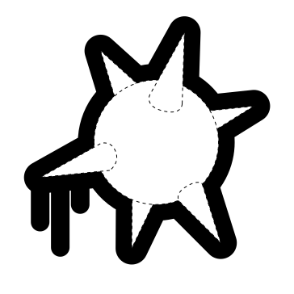

name: title_inversed_whiteText
layout: false
<!-- class: center, middle -->
class: center, middle, inverse

# Unikernels - The next big little thing ?
<!--  -->
<!-- ## Unikernels: The next big little thing ?
     #### C'est quoi les Unikernels ?
-->
<!--  -->

###Devconf.cz, Brno, Czech Republic, Jan 2017

<!-- <h3>  &nbsp;&nbsp; &nbsp;&nbsp; &nbsp;&nbsp; Mike Bright,  @mjbright </h3> -->

<br/>
<br/>
<h3>  &nbsp;&nbsp; &nbsp;&nbsp; &nbsp;&nbsp; Mike Bright,  @mjbright </h3>


???
SpeakerNotes:

Introduce ourselves.

---
name: template
layout: false
class: center, left
exclude: true
## Template page
<!-- .red[ TEST ]  .blue[TEST]  .green[TEST]  .yellow[TEST]  .magenta[TEST]  .cyan[TEST]  .pink[TEST] -->

.left-column[
]

.right-column[
]

.left[.footnote[.vlightgray[ @mjbright ]]]

???
SpeakerNotes:

---
name: section_overview
layout: false
class: center, left
## Unikernels
<!-- .red[ TEST ]  .blue[TEST]  .green[TEST]  .yellow[TEST]  .magenta[TEST]  .cyan[TEST]  .pink[TEST] -->

.left-column[
Overview
]

.right-column[

- What are Unikernels?
    - Why do we need them?
    - Domains of application

- Unikernel implementations
    -  Clean-slate or legacy
    -  Tooling

-  Containers and Unikernels

-  Demo

-  Conclusions

]

.left[.footnote[.vlightgray[ @mjbright ]]]

---
name: section_why_talk
layout: false
class: left
## Why this talk?
<!-- .red[ TEST ]  .blue[TEST]  .green[TEST]  .yellow[TEST]  .magenta[TEST]  .cyan[TEST]  .pink[TEST] -->

.left[.footnote[.vlightgray[ @mjbright ]]]

--

Curiosity about
- What we can expect to see from Unikernels (and Docker ...)
- Who the players are

--

1990's: First unikernels - Exokernel and Nemesis (Univ. Cambr)

--

Jan 2014: ACM - <a href="https://queue.acm.org/detail.cfm?id=2566628">"Unikernels: Rise of the Virtual Library Operating System"</a>, Anil Madhavapeddy and David J. Scott

--

Mar .red[2015]: Linux.com - <a href="https://www.linux.com/news/7-unikernel-projects-take-docker-2015">7 Unikernel Projects to Take On Docker in 2015</a>, Lars Kurth

--

Nov 2015: Docker Con Europe demo <a href="https://blog.docker.com/2016/01/unikernel/">Cool Hack "Unikernels, Meet Docker!"</a>

--

Jan 2016: Docker Blog - <a href="https://blog.docker.com/2016/01/unikernel/">Unikernel Systems Joins Docker</a>

--

Oct 2016: The NewStack - <a href="http://thenewstack.io/utilizing-unikernels-within-internet-things/">Debunking Unikernels</a>,  Idit Levine Dell-EMC

--

In 2017 ?
- MirageOS 3 will be released
- DockerCon US and EU


???
SpeakerNotes:

7 Unikernel Projects to Take On Docker in 2015:
There are several up-and-coming open source projects to watch this year, including ClickOS, Clive, HaLVM, LING, MirageOS, Rump Kernels and OSv among others, with each of them placing emphasis on a different aspect of the unikernel approach.  For example, MirageOS and HaLVM take a clean-slate approach and focus on safety and security, ClickOS emphasizes speed, while OSv and Rump kernels aim for compatibility with legacy software. Such flexible approaches are not possible with existing monolithic operating systems, which have decades of assumptions and trade-offs baked into them.

Why this talk?

---
name: section_history
layout: false
class: center, left
## .blue[What are Unikernels?] .lightgray["Library OS"]
<!-- .red[ TEST ]  .blue[TEST]  .green[TEST]  .yellow[TEST]  .magenta[TEST]  .cyan[TEST]  .pink[TEST] -->

.left[.footnote[.vlightgray[ @mjbright ]]]

Applications built with only the OS components they actually require,
e.g. TCP Stack, DNS, DHCP, NAT, F/w, Disk access.


--

Single process(**&#42;**) applications (no threads, forking or multi-user) (**&#42;**)

Small size (few lines of code) and very fast to boot

Small attack surface (potentially secure)

High performance - no context switches!

No shell

???
Speaker Notes:
Contrast
  + Typical application stack
  + Unikernel application stack


---
name: section_why
layout: false
class: center, left
## .blue[Why are Unikernels needed?]
<!-- .red[ TEST ]  .blue[TEST]  .green[TEST]  .yellow[TEST]  .magenta[TEST]  .cyan[TEST]  .pink[TEST] -->

.left[.footnote[.vlightgray[ @mjbright ]]]

Think for a moment - What OS do you run?

On what hardware?

Modern OS provide amazing backwards compatibility and features

--

But an app uses a tiny fraction of those features
consuming resources, increasing the attack surface (linux kernel ~ 25 M LOC)

--

<!--
We've moving on from monolithic applications on general purpose OS
to virtualized or containerized (&micro;-)services on general purpose OS
-->


--

<br/>
Unikernels provide an alternative

But are they a panacea?

???
SpeakerNotes:

---
name: section_where_needed
layout: false
class: left
<h2>.blue[In what domains might they be used?]</h2>
<!-- .red[ TEST ]  .blue[TEST]  .green[TEST]  .yellow[TEST]  .magenta[TEST]  .cyan[TEST]  .pink[TEST] -->

.left[.footnote[.vlightgray[ @mjbright ]]]

**Cloud Computing**

- Small (kB/MB) immutable entities with fast boot times (100's ms).

- Possibility of on-demand servers, &micro;-services

- Potentially greater security (< LOC)

--

**NFV (Network Functional Virtualization)**

- As cloud but stricter requirements on response times, service chaining

<a href="https://www.youtube.com/watch?v=3jGClCBXuTg" /> Unikernels meet NFV</a>;&nbsp;&nbsp; 
<a href="https://www.ericsson.com/research-blog/sdn/unikernels-meet-nfv/" />Ericsson Research Blog</a>;&nbsp;&nbsp; <a href="http://unikernel.org/blog/2016/unikernel-nfv-platform">Unikernels.org Blog</a>
<!-- Ericsson, NEC, Cisco are active in this domain -->

--

**IoT / Embedded**

- For low-resource, potentially secure elements (<u>baremetal</u> or &micro;-vmm ?)
- Build up the "*app*" instead of stripping down the "*OS*"

--

**HPC**

- Greater performance possible (but may be *hard work*)


???
SpeakerNotes:

---
name: section_where_needed
layout: false
class: left
<h2>.blue[In what domains might they be used? - NFV/SDN]</h2>


---
name: section_implem1
layout: false
class: center, left
exclude: true
## Unikernel Implementations - 2 families
<!-- .red[ TEST ]  .blue[TEST]  .green[TEST]  .yellow[TEST]  .magenta[TEST]  .cyan[TEST]  .pink[TEST] -->


.left[.footnote[.vlightgray[ @mjbright ]]]

???
SpeakerNotes:

---
name: section_implem1
layout: false
class: left

## .blue[Unikernel Implementations] - 2 families
<!-- .red[ TEST ]  .blue[TEST]  .green[TEST]  .yellow[TEST]  .magenta[TEST]  .cyan[TEST]  .pink[TEST] -->

<!-- .left-column[ Unikernel Families ] .right-column[ ] -->

There are 2 main classes of Unikernels
<!-- [ ] -->

--
<!-- .right-column[ ] -->

The *Clean-Slate* approach emphasizes safety and security.<br/>
Same language for application and Library OS components.
- MirageOS (Ocaml)
- HalVM (Haskell)
- LING  (Erlang)
<!-- [ ] -->
--
<!-- .right-column[ ] -->

The *Legacy* approach favours backward compatibility of existing applications based on POSIX-compatibilities.

Many applications have been ported
- OSv (Tomcat, Jetty, Cassandra, OpenJDK, ...)
- Rumprun (MySQL, PHP, Nginx)
- Runtimejs
- Clive (Go)
<!-- ] -->

???
Speaker Notes:

A number of unikernel open source projects are beginning to take off, each with its own unique focus and approach.
For example, MirageOS and HaLVM take a clean-slate approach and emphasize safety and security;
ClickOS stresses speed;
while OSv and Rump kernels aim for compatibility with existing applications. Both OSv and Rump kernels have made significant progress in porting existing applications: for example MySQL, PHP and Nginx have been ported to Rump Kernels, whereas many applications such as Tomcat, Jetty, Cassandra, OpenJDK and others have been ported to OSv. Meanwhile, MirageOS has demonstrated 1MB unikernels that serve DNS, Git and SSL web traffic with complete type safety down to the device drivers.


.left[.footnote[.vlightgray[ @mjbright ]]]

---
name: section_implem2
layout: false
class: center, left
## .blue[Unikernel Implementations]

.left[.footnote[.vlightgray[ @mjbright ]]]
<!-- .red[ TEST ]  .blue[TEST]  .green[TEST]  .yellow[TEST]  .magenta[TEST]  .cyan[TEST]  .pink[TEST] -->

Technology | Description |
-|:-|:-|-
**ClickOS** <a href="http://cnp.neclab.eu"> cnp.neclab.eu </a> | For embedded network h/w.<br/>~5MB images, boots <20ms, 45 &mu;s delay, 100 VMs => 10Gbps 
 | | |
Clive<br/><a href="http://lsub.org/ls/clive.html"> lsub.org</a> | Written in Go.  For distributed and cloud.
 | | |
**Drawbridge**<br/><a href="https://www.microsoft.com/en-us/research/project/drawbridge/"> MS </a> | Research prototype. Picoprocess/container with minimal kernel API surface, and Windows library OS.
 | | |
Graphene <a href="http://graphene.cs.stonybrook.edu/"> graphene</a> | Securing "*multi-process*" legacy apps - adds IPC.
 | | |
HaLVM <a href="galois.com"> galois.com </a> | Port of GHC (Glasgow Haskell Compiler) suite.<br/> Write apps in Haskell to run on Xen.
 | | |
IncludeOS <a href="http://www.includeos.org/"> includeos.org </a> | Research project for C++ code on virtual hardware.
 | | |
LING <a href="http://erlangonxen.org/"> erlangonxen.org </a> | Erlang/OTP runs on Xen.
 | | |
MirageOS <a href="https://mirage.io/"> mirage.io </a> | Clean-slate library OS for secure, high-perf network apps.  More than 100 MirageOS libraries plus OCaml ecosystem.
 | | |
OSv <a href="http://osv.io/"> osv.io </a> Cloudius | Run Linux binaries (w. limitations), supports C/C++, JVM, Ruby, Node.js
 | | |
Rumprun <a href="http://rumpkernel.org/"> rumpkernel.org </a> | FreeBSD - Runs POSIX s/w on BM or VM (Xen).
 | | |
Runtime.js <a href="http://runtimejs.org/"> runtimejs.org </a> | For cloud, JavaScript V8, lightweight immutable VM image runs on Qemu/KVM.

---
name: section_mirageos
layout: false
class: center, left
exclude: false
## .blue[Unikernel implementations - MirageOS]/Ocaml
<!-- .red[ TEST ]  .blue[TEST]  .green[TEST]  .yellow[TEST]  .magenta[TEST]  .cyan[TEST]  .pink[TEST] -->

.left-column[
Clean-Slate
<br/>
<br/>

<br/>
<a href="https://mirage.io/" >  https://mirage.io/ </a>

OCaml-Based

]

.right-column[

MirageOS "Library OS" components are written in <a href="https://en.wikipedia.org/wiki/OCaml"> Ocaml </a>.

ML-derived languages are best known for their static type systems and type-inferring compilers.

OCaml unifies functional, imperative, and object-oriented programming under an ML-like type system.

OCaml has extensive libraries available

(Unison utility)
]

---
name: section_mirageos
layout: false
class: center, left
exclude: false
## .blue[Unikernel implementations - MirageOS]-2
<!-- .red[ TEST ]  .blue[TEST]  .green[TEST]  .yellow[TEST]  .magenta[TEST]  .cyan[TEST]  .pink[TEST] -->

.left[.footnote[.vlightgray[ @mjbright ]]]
.left-column[
Clean-Slate
<br/>
<br/>

<br/>
<a href="https://mirage.io/" >  https://mirage.io/ </a>

OCaml-Based

]

.right-column[
MirageOS Unikernels are based on the Mirage-OS Unikernel base (OS library).

The mirage tool is used to build Unikernels for various backends:
- Xen Hypervisor (PV)
- Unix (Linux or OS/X binaries)
- Browser (via Ocaml->JS compiler !!)
- MirageOS 3 (/Solo5) will support kvm (/ukvm)
- Even an experimental BM backend for Raspberry Pi
]

--
.right-column[
Building applications for unix or xen
```
mirage configure -t unix
make
./mir-console
```

```
mirage configure -t xen
make
****xen create ./mir-console.xen
```

]

???
Speaker Notes:

See sources:
    /home/mjb/src/git/Unikernels/mirage-skeleton/hello
ean Grove - From Unikernels to Databases to UIs: Truly full-stack apps in OCaml - Curry On
Sean Grove - From Unikernels to Databases to UIs: Truly full-stack apps in OCaml - Curry On
      https://www.youtube.com/watch?v=QWfHrbSqnB0

---
name: section_mirageos
layout: false
class: center, left
exclude: false
## .blue[Unikernel implementations - MirageOS - Use Cases]
<!-- .red[ TEST ]  .blue[TEST]  .green[TEST]  .yellow[TEST]  .magenta[TEST]  .cyan[TEST]  .pink[TEST] -->

.left-column[
Clean-Slate
<br/>
<br/>

<br/>
<a href="https://mirage.io/" >  https://mirage.io/ </a>
]

.right-column[
- <div> BNC Pinata: http://ownme.ipredator.se/  </div>

- Networking applications
    - e.g. CyberChaff  "false network hosts"

- PayGarden, Sean Grove
  <br/><a href="https://www.youtube.com/watch?v=i9eu9e7gN0Q" />  "Baby steps to unikernels in production" </a>
    - Too painful to create/configure AMI images on AWS
    - Solo5 allows to create KVM images deployable on GCE

]

.left[.footnote[.vlightgray[ @mjbright ]]]

???
Speaker Notes:

For me:
<a href="https://eventil.com/users/sgrove" /> sgrove </a>
<a href="https://github.com/ocamllabs/icfp2016-blog/blob/master/CUFP/baby-steps-to-unikernels-in-pr.md" /> Blog notes </a>


---
name: section_tools
layout: false
class: center, left
## .blue[Unikernel Tooling]
<!-- .red[ TEST ]  .blue[TEST]  .green[TEST]  .yellow[TEST]  .magenta[TEST]  .cyan[TEST]  .pink[TEST] -->


.left[.footnote[.vlightgray[ @mjbright ]]]

.right-column[
- <a href="https://github.com/emc-advanced-dev/unik"> Unik [EMC-Dell]</a>: "*The Unikernel Compilation and Deployment Platform*" (+ image hub)
    - rumprun: Python, Node.js and Go
    - OSv: Java, Node.js, C and C++
    - IncludeOS: C++
    - MirageOS: OCaml


- <a href="https://developer.ibm.com/open/openprojects/solo5-unikernel/"> Solo5 [IBM] </a>: An alternative unikernel-base for MirageOS 
    - Provides qemu/KVM support for MirageOS
    - Is currently being integrated into MirageOS 3 beta

- ukvm [IBM]: An alternative VM Monitor
    - a "*library hypervisor*"

- <a href="http://osv.io/capstan/"> capstan </a>: OSv build tool (+ image hub)
]

???
SpeakerNotes:

---
name: section_tools
layout: false
class: center, left
## .blue[Unikernel Tooling]
<!-- .red[ TEST ]  .blue[TEST]  .green[TEST]  .yellow[TEST]  .magenta[TEST]  .cyan[TEST]  .pink[TEST] -->

<a href="https://github.com/mirage/jitsu" > MirageOS *jitsu* </a> : "Just-In-Time Summoning of Unikernels"

A DNS server that starts unikernels on demand.


Tested with MirageOS and Rumprun unikernels.

<a href="https://github.com/mirage/jitsu"> https://github.com/mirage/jitsu </a>

.left[.footnote[.vlightgray[ @mjbright ]]]

---
name: section_containers
layout: false
class: left
## .blue[Unikernels and Containers] : &nbsp;&nbsp;&nbsp;&nbsp;&nbsp;&nbsp;  .magenta[My guess ...]
<!-- .red[ TEST ]  .blue[TEST]  .green[TEST]  .yellow[TEST]  .magenta[TEST]  .cyan[TEST]  .pink[TEST] -->

.left[.footnote[.vlightgray[ @mjbright ]]]

So what about Containers? ... and why did Docker buy Unikernel Systems?

<!-- <a href="https://www.infoq.com/interviews/chaudhry-unikernels-docker" /> Info.Q / Amir, Aug 2016 </a> -->

--

- Unikernel Systems are involved in MirageOS/Xen

- Unikernels already used as specific functions in  "*Docker for Mac*" <!-- - VPNKit, DataKit -->

--

Guessing:
- **No-brainer**: Provide build/ship/run tools for Unikernels
  - **build**:
     - tools to facilitate building Unikernels
     - *test*: run Unikernels in containers to faciltate testing
          https://github.com/mato/docker-unikernel-runner
  - **ship**: Docker registry extended to provide Unikernel images
  - **run**: Docker Swarm orchestrates **tasks** incl. Unikernels

--

- Secure Container deployments through hybrid solutions
    - Secure front-ends made of unikernels
        - e.g. for OCaml MediaWiki (http2https, tlstunnel, ...)
    - Containers for backend

- Surprises? ...

.left[.footnote[.vlightgray[ @mjbright ]]]

???
Speaker Notes:

```
So yes, it's right. I'm still working on Unikernels. I'm very happy today. So one of the things that's important to think about is that essentially where do Unikernels and containers sit? We see them as sitting on the same continuum and that continuum is one of specialization, some degree of isolation. So containers is something you can use to help package up your application and share a kernel across the containers. And that makes it easy for me to develop essentially a great application and deploy it. But you can think about the progression from that, from a full traditional OS to containerized applications and what comes next, what is further along on that spectrum of specialization. And that's where Unikernels sit. 

So it's like an extreme form of specialization which is something we have already talked about for many years. So you essentially take the components that you need, your application, the components you need, compile that down into an image that you can deploy. So given these things are all on the same continuum, it just made sense that the same tooling should work for all of them. So that's why it makes sense for Unikernel Systems and Docker, Unikernels themselves and containers to work together.
```


---
name: section_subsecn
layout: false
class: center, middle, inverse
## Demo

  <br/>

DeferPanic - Unikernel IaaS - https://deferpanic.com/

runtime.js - Node.js Unikernel - https://github.com/runtimejs/example-web-server

4 unikernel demos - Look Ma, no OS! - https://github.com/technolo-g/lookma

???
SpeakerNotes:
#### - <a href="https://github.com/xxx/xxx"/> xxx </a> [xx yy]

---
name: section_conclusion
layout: false
class: left
## .blue[Conclusions] 
<!-- &nbsp;&nbsp;&nbsp;&nbsp;&nbsp;&nbsp;&nbsp;&nbsp; &nbsp;&nbsp;&nbsp;&nbsp;&nbsp;&nbsp;&nbsp;&nbsp; &nbsp;&nbsp;&nbsp;&nbsp;&nbsp;&nbsp;&nbsp;&nbsp; &nbsp;&nbsp;&nbsp;&nbsp;&nbsp;&nbsp;&nbsp;&nbsp; -->
<!-- .red[ TEST ]  .blue[TEST]  .green[TEST]  .yellow[TEST]  .magenta[TEST]  .cyan[TEST]  .pink[TEST] -->


- Much work needs to be done
  - to make them easy to build, deploy, .red[*debug*]
  - We will see easier to use solutions
      - Whatever Docker plan to surprise us with
      - Unik will facilitate building, deploying multiple technologies
      - Solo5 will allow mixing of technologies

- Several disparate technologies today
  - but some efforts to synergize

- Unikernels are an interesting complimentary technology to containers
  - We can expect hybrid solutions

- 2017 will be an interesting year for Unikernels

.left[.footnote[.vlightgray[ @mjbright ]]]

???
SpeakerNotes:

---
layout: false
class: center, left

## Resources

|   | |    |
|---|---|----|
|  | Scoop.it<br/>Unikernels| <a href="http://www.scoop.it/t/unikernels"> www.scoop.it/t/unikernels </a> |
|  | Youtube<br/>Playlist| <a href="https://www.youtube.com/playlist?list=PLCDlZzVd_jn8heLw_Q10gOaEflLZKyf81"> youtube.com/.../unikernels </a> |
|  | Wikipedia| <a href="https://en.wikipedia.org/wiki/Unikernel"> en.wikipedia.org/wiki/Unikernel </a> |
|  | unikernels.org| <a href="https://unikernels.org"> unikernels.org </a> |
|  | mirageos.io | <a href="https://mirageos.io"> mirageos.io </a> <br/> <a href="https://mirage.io/docs/papers"> mirage.io/docs/papers </a> |
|  | OReilly<br/>"Unikernels" | <a href="http://unikernel.org/blog/2016/unikernel-ebook"> Free download </a> |
|  | @unikernel| <a href="https://twitter.com/unikernel"> @unikernel </a> |
|  | github.com/ocamllabs | <a href="https://github.com/ocamllabs"> ocamllabs </a> |
|  | github.com/mirage | <a href="https://github.com/mirage"> MirageOS </a> |


.left[.footnote[.vlightgray[ @mjbright ]]]

---
name: section_qa
layout: false
class: center, middle, inverse
## Thank you
## .blue[Q&A]

???
SpeakerNotes:


