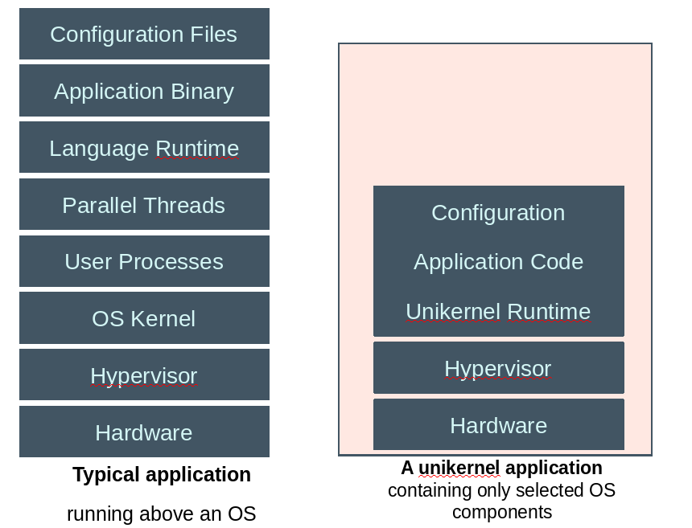

name: title_inversed_whiteText
layout: false
class: center, middle


#Technologies

###The next big little thing?
<h3> Michael Bright,  @mjbright </h3>

.left[.footnote[.vlightgray[ @mjbright ]]]

???
SpeakerNotes:

Introduce ourselves.

Why this presentation?

---
name: title_inversed_whiteText
layout: false
class: left, middle

## Agenda

- What are Unikernels ?
  - What they are not.

- Why Unikernels ?
  - Advantages / Characteristics
  - Application domains

- Implementations

- Usage: Baremetal anyone ?

- Where’s it all heading ?

- Demos

.left[.footnote[.vlightgray[ @mjbright ]]]

???
SpeakerNotes:

Introduce ourselves.

Why this presentation?
---

name: title_inversed_whiteText
layout: false
class: inverse, center, middle

## What's it all about ?

.left[.footnote[.vlightgray[ @mjbright ]]]

???
Speaker notes:


---
name: section_overview
layout: false
class: center, left

<!-- .red[ TEST ]  .blue[TEST]  .green[TEST]  .yellow[TEST]  .magenta[TEST]  .cyan[TEST]  .pink[TEST] -->

## “Unikernels are specialized, single-address-space machine images constructed by using library operating systems”

### “What are Unikernels”, unikernel.org

---
name: section_overview
layout: false
class: center, left

## What are Unikernels? - They are "Library OS"

<table style="width:100%; solid black; ">
  <tr>  <th>  </th> <th></th> </tr>
<tbody text-align="true">
<tr>
    <td style="width:100%; border: 1px solid black; background-color: #f1f1c1;">
Unikernels are specialized applications built with all, but only, the OS components they need.
<hr/>

A Unikernel is standalone able to run directly as a VM (or possibly on BM)
<hr/>

OS components such as
Network stack,
File-system,
Device drivers
<hr/>

Typically, there is no file-system for example, so configuration is stored in the unikernel binary

    </td>  <td> </td>
                               <td>  </td>
</tr>
</tbody>
</table>

---
name: section_overview
layout: false
class: left
exclude: false

## Unikernels: What they are not ...
<!-- .red[ TEST ]  .blue[TEST]  .green[TEST]  .yellow[TEST]  .magenta[TEST]  .cyan[TEST]  .pink[TEST] -->

They are **not** minified **general purpose OS**
- Not micro-kernels
- Not minified Linux kernels or container OS

They are **not** real-time Oses
- But they are very fast

They are **not**
- Exokernels SURE?
- Multi-kernels (*though* HermitCore is !)
- Multi-process (*though* Graphene is !)

They work on similar principles but are not all the same


---
name: section_overview
layout: false
class: left

## Unikernels: Advantages / Characteristics
<!-- .red[ TEST ]  .blue[TEST]  .green[TEST]  .yellow[TEST]  .magenta[TEST]  .cyan[TEST]  .pink[TEST] -->

Very small compared to app plus OS
- use few resources
- immutable, suitable for micro-services

No separate kernel
- No user space copies

Fast to launch

Contain only the needed functionality
- No legacy drivers
- No unneeded shell

More difficult to develop with
- Have less underlying features
- **Can** be debugged but tethered like for an embedded device

Potentially more secure
- small attack surface
- If compromised an attacker can’t do much as no shell, no users, processes ...


---
name: section_overview
layout: false
class: left

## Unikernels: Application Domains
<!-- .red[ TEST ]  .blue[TEST]  .green[TEST]  .yellow[TEST]  .magenta[TEST]  .cyan[TEST]  .pink[TEST] -->

Cloud Computing
- Fast to boot: On demand services

NFV
- Fast to boot: On demand services

IoT / embedded
- IoT is essentially distributed embedded plus data collection/analysis, cloud communication …

HPC
- Secure in the cloud
- Very efficient (no context switches, just 1 process)

---

name: title_inversed_whiteText
layout: false
class: inverse, center, middle

## Unikernel implementations

.left[.footnote[.vlightgray[ @mjbright ]]]

???
Speaker notes:
---
name: section_overview
layout: false
class: left
## Unikernel Implementations: 2 families

<!-- .red[ TEST ]  .blue[TEST]  .green[TEST]  .yellow[TEST]  .magenta[TEST]  .cyan[TEST]  .pink[TEST] -->

<br/>
<table style="width:100%; border: 1px solid black; background-color: #f1f1c1;">
  <tr>  <th> Clean-Slate </th> <th>  </th> <th>Legacy</th> </tr>
<tbody text-align="true">
<tr>
    <td> - A minimalist approach </td>  <td> </td>
                               <td> - POSIX compatibility </td>
</tr> <tr>
    <td> - Re-implement all OS functions </td> <td> </td>
                               <td> - Re-use existing libraries</td>
</tr> <tr>
    <td> - Typically uses type safe language </td> <td> </td>
                               <td> - Possible binary compatibility</td>
</tr> <tr>
    <td> - Very small code size, resources </td> <td> </td>
                               <td> - Small to large code size/resources </td>
</tr> <tr>
    <td> - Harder to develop apps </td> <td> </td>
                               <td> - Easier to develop apps </td>
</tr> <tr>
</tr>
</tbody>
</table>

???

Clean-slate Unikernels
- a minimalist approach, implementing the Unikernel base and application in the same language
- Complete implementation
- typically a strongly typed functional language (Ocaml, Haskell, Erlang)

Legacy Unikernels
- Strive for some POSIX compatibility

---
name: section_overview
layout: false
class: center,middle
## Unikernel Implementations:

<!-- .red[ TEST ]  .blue[TEST]  .green[TEST]  .yellow[TEST]  .magenta[TEST]  .cyan[TEST]  .pink[TEST] -->

<table style="width:100%; border: 1px solid black; background-color: #f1f1c1;">
  <tr>  <th> Clean-Slate </th> <th>  </th> <th>Legacy</th> </tr>
<tbody text-align="true">
<tr>
    <td> MirageOS </td>  <td> </td>
                               <td> OSv </td>
</tr> <tr>
    <td> HalVM </td> <td> </td>
                               <td> IncludeOS </td>
</tr> <tr>
    <td> LING </td> <td> </td>
                               <td> Rumprun (+LKL) </td>
</tr> <tr> <td> </td> <td> </td> <td> HermitCore </td>
</tr> <tr> <td> </td> <td> </td> <td> Graphene </td>
</tr> <tr> <td> </td> <td> </td> <td> ClickOS </td>
</tr> <tr> <td> </td> <td> </td> <td> Vorteil </td>
</tr> <tr> <td> </td> <td> </td> <td> Clive </td>
</tr> <tr> <td> </td> <td> </td> <td> Runtimejs </td>
</tr> <tr> <td> </td> <td> </td> <td> Magnios </td>
</tr> <tr> <td> </td> <td> </td> <td> Ultibo </td>
</tr> <tr> <td> </td> <td> </td> <td> Drawbridge </td>
</tr> <tr> <td> </td> <td> </td> <td> ... others ? ... </td>
</tr> <tr>
</tr>
</tbody>
</table>

---
name: section_mirageos
layout: false
class: center,left
## Unikernel Implementations: MirageOS - Xen project

.left-column[
Clean-Slate
<br/>
<br/>

<br/>
<a href="https://mirage.io/" >  https://mirage.io/ </a>

OCaml-Based

]

.right-column[

MirageOS "Library OS" components and apps are written in <a href="https://en.wikipedia.org/wiki/OCaml"> Ocaml </a>,
a type-safe functional(+OOP) language with extensive libraries.

The mirage tool is used to build Unikernels for various backends:
- Xen Hypervisor (PV)
- Unix (Linux or OS/X binaries)
- MirageOS 3 (/Solo5) now supports kvm (/ukvm) and xhyve

Building applications for unix or xen
```
mirage configure -t [unix|xen|ukvm]
make depend
make
./mir-console
```

**Use cases**: BNC Pinata, E/// Research NFV, PayGarden
]

.left[.footnote[.vlightgray[ @mjbright ]]]

???
Speaker Notes:

For me:
<a href="https://eventil.com/users/sgrove" /> sgrove </a>
<a href="https://github.com/ocamllabs/icfp2016-blog/blob/master/CUFP/baby-steps-to-unikernels-in-pr.md" /> Blog notes </a>


???
Speaker Notes:

See sources:
    /home/mjb/src/git/Unikernels/mirage-skeleton/hello
ean Grove - From Unikernels to Databases to UIs: Truly full-stack apps in OCaml - Curry On
Sean Grove - From Unikernels to Databases to UIs: Truly full-stack apps in OCaml - Curry On
      https://www.youtube.com/watch?v=QWfHrbSqnB0

---
name: section_mirageos
layout: false
class: center, left
exclude: true
## .blue[Unikernel implementations - MirageOS - Use Cases]
<!-- .red[ TEST ]  .blue[TEST]  .green[TEST]  .yellow[TEST]  .magenta[TEST]  .cyan[TEST]  .pink[TEST] -->

.left-column[
Clean-Slate
<br/>
<br/>

<br/>
<a href="https://mirage.io/" >  https://mirage.io/ </a>
]

.right-column[
- <div> BNC Pinata: http://ownme.ipredator.se/  </div>

- Networking applications
    - Ericsson Research NFV experiment

- PayGarden, Sean Grove
  <br/><a href="https://www.youtube.com/watch?v=i9eu9e7gN0Q" />  "Baby steps to unikernels in production" </a>
    - Too painful to create/configure AMI images on AWS
    - Solo5 allows to create KVM images deployable on GCE

]


---
name: section_overview
layout: false
class: center,left
## Unikernel Implementations: OSv

---
name: section_overview
layout: false
class: center,left
## Unikernel Implementations: Rumprun

---
name: section_overview
layout: false
class: center,left
## Unikernel Implementations: HermitCore

---
name: section_overview
layout: false
class: left
## What's coming?
<!-- .red[ TEST ]  .blue[TEST]  .green[TEST]  .yellow[TEST]  .magenta[TEST]  .cyan[TEST]  .pink[TEST] -->


Docker bought Unikernel Systems (main MirageOS developers) in Jan 2016
- Unikernel technology used in Docker for Mac, Docker for Windows

MirageOS v3 released in March 2017
- This will accelerate the Unikernel eco-system as it
- improves MirageOS implementation (less code, more func)
- Enables other backends: kvm via Solo5 (and ukvm)
- Ongoing work for ARM support
- Being considered as backend for HalVM

Unikernels are becoming easier to use
- As individual Unikernel projects advance
- Docker facilitate Build Ship and Run for containers and other technologies
- EMC unik project also facilitates use of different Unikernel technologies

Several Unikernel projects advance
- Rumprun
- HalVM v3 ??
- vorteil:.io

---
name: section_overview
layout: false
class: left
## Unikernels: Usage? Baremetal?
<!-- .red[ TEST ]  .blue[TEST]  .green[TEST]  .yellow[TEST]  .magenta[TEST]  .cyan[TEST]  .pink[TEST] -->

#### Hybrid solutions
- Unikernels for very specific applications such as target networking components
    - DNS
    - DHCP
    - NAT
    - Firewall
    - TLS

#### But what about Baremetal ?
Some Unikernel technologies target baremetal, but it is not appropriate for all use cases
You won’t want to dedicate your latest Proliant server to one Unikernel (flea on an elephant’s back), but rather to a Hypervisor running Unikernels

But baremetal Unikernels may be appropriate for the smallest IoT devices (webcam, sensor)

---
name: section_overview
layout: false
class: inverse, center, middle
## Demo
<!-- .red[ TEST ]  .blue[TEST]  .green[TEST]  .yellow[TEST]  .magenta[TEST]  .cyan[TEST]  .pink[TEST] -->

---
name: section_overview
layout: false
class: inverse, center, middle
## Q&A
<!-- .red[ TEST ]  .blue[TEST]  .green[TEST]  .yellow[TEST]  .magenta[TEST]  .cyan[TEST]  .pink[TEST] -->

---
name: section_overview
layout: false
class: inverse, center, middle
## Resources
<!-- .red[ TEST ]  .blue[TEST]  .green[TEST]  .yellow[TEST]  .magenta[TEST]  .cyan[TEST]  .pink[TEST] -->


---
name: section_overview
layout: false
class: center, left
## Resources - General
<!-- .red[ TEST ]  .blue[TEST]  .green[TEST]  .yellow[TEST]  .magenta[TEST]  .cyan[TEST]  .pink[TEST] -->

<table style="width:100%; border: 1px solid black; background-color: #f1f1c1;">
  <tr> <th></th> <th>URL</th> <th></th> </tr>
<tbody text-align="true">
<tr style="background-color: #818181;"> <td>.</td><td> </td><td> </td></tr>
<tr><td> Unikernel.org </td><td> <a href="http://unikernel.org"> site </a> </td><td> </td></tr>
<tr><td> Wikipedia </td><td> <a href="https://en.wikipedia.org/wiki/Unikernel"> Wiki </a> </td><td> </td></tr>
<tr style="background-color: #818181;"> <td>.</td><td> </td><td> </td></tr>
<tr><td> Scoop.It </td><td> <a href="http://www.scoop.it/t/unikernels/"> Unikernels</a> </td><td> </td></tr>
<tr><td> Playlist </td><td> <a href="https://www.youtube.com/playlist?list=PLCDlZzVd_jn8heLw_Q10gOaEflLZKyf81"> YouTube Unikernels</a> </td><td> </td></tr>
</tbody>
</table>


---
name: section_overview
layout: false
class: center, left
## Resources - Unikernel Implementations
<!-- .red[ TEST ]  .blue[TEST]  .green[TEST]  .yellow[TEST]  .magenta[TEST]  .cyan[TEST]  .pink[TEST] -->

<table style="width:100%; border: 1px solid black; background-color: #f1f1c1;">
  <tr> <th>Technology</th> <th>Backers</th> <th>URL</th> <th></th> </tr>
<tbody text-align="true">
<tr style="background-color: #818181;"> <td>.</td><td> </td><td> </td></tr>
<tr><td> MirageOS </td><td>Xen</td><td> <a href="http://mirage.io"> mirage.io </a> </td><td> </td></tr>
<tr><td> HalVM </td><td> Galois</td><td> <a href="https://galois.com/project/halvm/">galois.com/project/halvm</a> </td><td> </td></tr>
<tr><td> LING </td><td> </td><td> <a href="http://erlangonxen.org/">erlangonxen.org</a> </td><td> </td></tr>
<tr style="background-color: #818181;"> <td>.</td><td></td><td> </td><td> </td></tr>
<tr><td> IncludeOS </td><td></td><td> <a href="http://www.includeos.org/"> includeos.org</a> </td><td> </td></tr>
<tr><td> Rumprun </td><td> NetBSD</td><td> <a href="http://rumpkernel.org/">rumpkernel.org</a> </td><td> </td></tr>
<tr><td> OSv </td><td>Cloudius</td><td> <a href="http://osv.io/">osv.io</a> </td><td> </td></tr>
<tr><td> HermitCore </td><td> Univ. Aachen</td><td> <a href="http://www.hermitcore.org/">hermitcore.org</a> </td><td> </td></tr>
</tbody>
</table>


---
name: section_overview
layout: false
class: center, left
## Resources - Unikernel Implementations (2)
<!-- .red[ TEST ]  .blue[TEST]  .green[TEST]  .yellow[TEST]  .magenta[TEST]  .cyan[TEST]  .pink[TEST] -->

<table style="width:100%; border: 1px solid black; background-color: #f1f1c1;">
  <tr> <th>Technology</th> <th>Backers</th> <th>URL</th> <th></th> </tr>
<tbody text-align="true">
<tr><td> Ultibo (Raspi) </td><td></td><td> <a href=""> </a> </td><td> </td></tr>
<tr><td> Clive (Go) </td><td></td><td> <a href=""> </a> </td><td> </td></tr>
<tr style="background-color: #818181;"> <td>.</td><td> </td><td> </td></tr>
<tr><td> Drawbridge </td><td>Microsoft</td><td> <a href="https://www.microsoft.com/en-us/research/project/drawbridge/">project/drawbridge</a> </td><td> </td></tr>
<tr><td> Rumprun </td><td></td><td> <a href=""> </a> </td><td> </td></tr>
<tr><td> OSv </td><td></td><td> <a href=""> </a> </td><td> </td></tr>
<tr><td> HermitCore </td><td></td><td> <a href=""> </a> </td><td> </td></tr>
</tbody>
</table>


---
name: section_overview
layout: false
class: center, left
## Resources - Unikernel Implementations (2)
<!-- .red[ TEST ]  .blue[TEST]  .green[TEST]  .yellow[TEST]  .magenta[TEST]  .cyan[TEST]  .pink[TEST] -->

<table style="width:100%; border: 1px solid black; background-color: #f1f1c1;">
  <tr> <th></th> <th>URL</th> <th></th> </tr>
<tbody text-align="true">
<tr style="background-color: #818181;"> <td>.</td><td> </td><td> </td></tr>
<tr><td> Unikernel.org </td><td> <a href="http://unikernel.org"> site </a> </td><td> </td></tr>
<tr><td> Wikipedia </td><td> <a href="https://en.wikipedia.org/wiki/Unikernel"> Wiki </a> </td><td> </td></tr>
<tr style="background-color: #818181;"> <td>.</td><td> </td><td> </td></tr>
<tr><td> Scoop.It </td><td> <a href="http://www.scoop.it/t/unikernels/"> Unikernels</a> </td><td> </td></tr>
<tr><td> Playlist </td><td> <a href="https://www.youtube.com/playlist?list=PLCDlZzVd_jn8heLw_Q10gOaEflLZKyf81"> YouTube Unikernels</a> </td><td> </td></tr>
</tbody>
</table>


