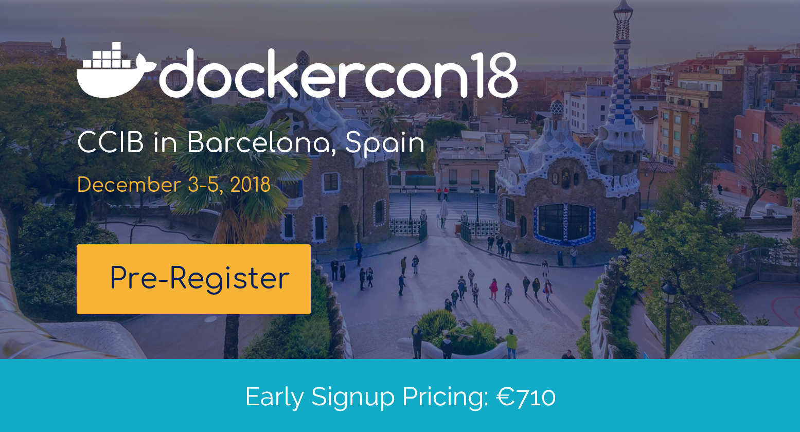

name: separator
layout: true
class: center, top, inverse

<!-- goto a specific slide using e.g.
   url#walign1
or
   [link](#walign1)
-->

 @mjbright Consulting 

---
name: nofooter
layout: true
class: center, top, inverse

<!-- NO FOOTER -->

---
name: nofootertl
layout: true
class: left, top, inverse

<!-- NO FOOTER -->

---
name: wseparator
layout: true
class: left, top

 @mjbright Consulting 

---
name: wseparatorct
layout: true
class: center, top

 @mjbright Consulting 

---
name: sep_image
layout: true
class: center, top, inverse
background-image: url(../../images/grenoble.png)
background-position: center
background-repeat: no-repeat
background-size: contain

 @mjbright Consulting 

---
name: standard
layout: true
class: center, top

 @mjbright Consulting 

---
template: nofooter
background-color: lightblue

.listitem[ Annonces DockerCon 2018 - 28 June 2018, Grenoble ]

.listitem[Michael Bright, @mjbright Consulting]

 Slides & source code at <u><a href="https://mjbright.github.io/Talks"> https://mjbright.github.io/Talks </a></u> 

---
template: nofootertl
background-color: lightblue

.listitem[Agenda]
 

<!-- class: largebullets, left, top, inverse -->

.smenuitem[ Tour de Table - "Connaissez-vous DockerCon?" ]

.smenuitem[ Schedule - Labs, Keynotes, Breakouts, Party, Hallway Tracks ... ]

.smenuitem[ Keynote Announcements ] 

.smenuitem[ Breakout Sessions - the best ]

.smenuitem[ Cool Hacks ]

.smenuitem[ DockerCon Europe, 3-5 Dec, Barcelona ]

---
template: nofootertl
background-color: lightblue

.listitem[Michael Bright, @mjbright Consulting]
 

<!-- class: largebullets, left, top, inverse -->

.smenuitem[ Cloud Native Solution Architect <!-- (12-factor++) --> ]

.smenuitem[ Trainer: Kubernetes, Serverless, Docker, CloudNative ] 

.smenuitem[ Past researcher, dev, team lead, dev advocate ]

.smenuitem[ British, living in France for 25-years ]

.smenuitem[ Docker Community Lead, Python User Group ]

.footnote[
.smenuitem[  linkedin.com/in/mjbright  github.com/mjbright ]
]

---
template: nofooter
background-color: lightblue

.listitem[ DockerCon 2018 Schedule ]

<!--  -->

---
template: nofooter
background-color: lightblue

.listitem[ DockerCon 2018 Schedule ]

---
template: nofooter
background-color: lightblue

.listitem[ Preconference Training Day ]

2-hour workshops, $300

.ssmenuitem[Using Istio - Lee Calcote, SolarWinds]

.ssmenuitem[Migrating a .Net App to Docker - Steven Follis, Docker]

.ssmenuitem[Migrating a Java App to Docker - Sophia Parafina, Docker]

.ssmenuitem[Docker Storage Concepts - Derrick Miller/Dan Finneran, Docker]

.ssmenuitem[Networking For Swarm And Kubernetes In Docker Enterprise Edition - Andy Randall, Docker]

.ssmenuitem[Monitoring And Logging - Brian Christner, Docker]

.ssmenuitem[Container Troubleshooting With Sysdig - Michael Ducy, Sysdig]

.ssmenuitem[Secure, Automated Software Supply Chain - Andy Clemenko, Docker]

---
template: nofootertl
background-color: lightblue

.listitem[Day0: Training, Captains, Community Leaders ...]
 

<table><tr>
<td>
.slistitem[ Docker Captains ]
.img-80[  ]
</td>
<td>
.slistitem[ Community Leaders ]
.img-80[  ]
</td>
</tr></table>

---
template: nofootertl
background-color: lightblue

.listitem[Day1: KeyNote/Breakouts, Community Theatre]
<!-- images/0_Videos_Keynotes_CoolHacks.PNG -->

.smenuitem[ 2hr Keynote: ]

---
template: nofootertl
background-color: lightblue

.listitem[Day1: KeyNote/Breakouts, Community Theatre]

<b> SIGN UP </b> FOR Docker Desktop BETA

---
template: nofootertl
background-color: lightblue

.listitem[Day1: KeyNote/Breakouts, Community Theatre]

---
template: nofootertl
background-color: lightblue

.listitem[Day1: KeyNote/Breakouts, Community Theatre]

<!-- .menuitem[ McKesson use case ... ] -->

.menuitem[ The Promise of Choice ]

---
template: nofootertl
background-color: lightblue

.listitem[Day1: KeyNote/Breakouts, Community Theatre]

---
template: nofootertl
background-color: lightblue

.listitem[Day1: KeyNote/Breakouts, Community Theatre]

<b> SIGN UP </b> FOR Docker Enterprise BETA
- Choice of app definition (k8s or compose yaml)
- Choice of Linux/Windows containers
- Choice of Swarm/Kubernetes orchestrator/cli
- Kubernetes on Docker EE/Windows Server

---
template: nofootertl
background-color: lightblue

.listitem[Day1: KeyNote/Breakouts, Community Theatre]
 

<b> SIGN UP </b> FOR Docker Federation BETA

<b> Demo </b>: <b> Docker EE </b>

Moved on-premises staging cluster to production cloud

Replicated from East- to West-coast 

<!-- - Uses cloud providers hosted Kubernetes services
  - AWS EKS
-->

---
template: nofootertl
background-color: lightblue

.listitem[Day1: Breakouts ]

<!-- A Vision of Persistence
- Container Orchestration from Theory to Practice
- Docker Platform Internals - Taking runtimes and image creation to the next level with containerd and BuildKit
- Istio - Managing, Securing, and Observing Microservices
- Java in a World of Containers
- Kubernetes Extensibility
- Kubernetes with Docker
- Windows Container Security

Tweets, Photos
-->

---
template: nofootertl
background-color: lightblue

.listitem[Day1: Breakouts ]

<!-- .smenuitem[ Breakouts - contribute-collaborate ]
- Cloud Native Projects SIG Session
- Container Innovation SIG Session
- Contributing 101 
- Docker Platform Internals SIG
Tweets, Photos -->

---
template: nofootertl
background-color: lightblue

.listitem[Day1: Breakouts ]

<!-- .smenuitem[ Breakouts - docker-docker-docker ]
- Docker Enterprise Edition - An Architecture and Operations Overview
- Docker for Developers on Mac and Windows
- Docker Storage - Designing a Platform for Persistent Data
- How To Build Your Containerization Strategy
- Networking in Docker Enterprise Edition with Kubernetes and Swarm
- Troubleshooting Tips from Docker Support Engineers
weets, Photos -->

---
template: nofootertl
background-color: lightblue

.listitem[Day1: Breakouts ]

<!-- .smenuitem[ Breakouts - docker-in-production ]
- All Roads Lead to the Cloud - Liberty Mutual’s Journey with Docker EE
- Disruption from Within– Innovation at Franklin American
- Docker on Docker - Leveraging Kubernetes in Docker EE to Power Infrastructure at Docker
- Faster, Safer and 100% User-Centric Application at Equifax with Docker
- How to Accelerate Docker Adoption With a Simple and Powerful User Experience

Tweets, Photos -->

---
template: nofootertl
background-color: lightblue

.listitem[Day1: Breakouts ]

<!-- .smenuitem[ Breakouts - innovation ]
- Accelerating Development Velocity of Production ML Systems with Docker
- Accessible High Performance Computing for Everyone with Docker and Containers
- Automated Hardware Testing Using Docker for Space
- Best Practices and Standards for Container Security
- Democratizing Machine Learning on Kubernetes
- Docker and IoT - Controlling “Things” with Containers
- Docker, Microservices, and the Service Mesh
- Packaging Software for the Distribution on the Edge with Docker and Windows Server
- Panel Discussion - Serverless

Tweets, Photos -->

---
template: nofootertl
background-color: lightblue

.listitem[Day1: Breakouts ]

<!-- .smenuitem[ Breakouts - transform ]
- bigwhale - An Unexpected Journey into Containerization @ Lockheed Martin–Part 1
- 5 Practices for Better, Cheaper, Faster Service Delivery
- A Strong Belief, Loosely Held - Bringing Empathy to IT
- Building a Docker Center of Excellence - Panel Discussion with MetLife, PayPal, and Splunk
- Digital Transformation with Docker, Cloud, and DevOps - How JCPenney Handles Black Friday and 100K Deployments Per Year
- Diversity is Not Only About Ethnicity and Gender
- Shaving my Head Made me a Better Programmer
- The Complexity to “Yes” in Analytics Software and the Possibilities with Docker and Containers

Tweets, Photos -->

---
template: nofootertl
background-color: lightblue

.listitem[Day1: Breakouts ]

<!-- .smenuitem[ Breakouts - using-docker ]
- 5 Patterns for Success for Application Transformation
- Building Your Production Tech Stack for Docker Container Platform
- Creating Effective Docker Images
- Demystifying Container Connectivity with Kubernetes in Docker
- Don’t have a Meltdown! Practical Steps for Defending Your Apps
- Gordon's Secret Session - Kubernetes on Windows with Docker Enterprise Edition
- Message–Based Microservices Architectures Driven With Docker
- Proactive Ops for Container Orchestration Environments
- Production SecOps with Kubernetes in Docker
- Tips and Tricks of the Docker Captains
-->

---
template: nofootertl
background-color: lightblue

.listitem[Day1: Party !!]

<!--
DockerCon 2018 SF - Day 1 General Session - June 13, 2018-SGBEq4A8ZHQ.mp4
Why our DockerCon 2018 Speakers are excited to be there-DssVkjJ2YLE.mp4
Tweets, Photos -->

---
template: nofootertl
background-color: lightblue

.listitem[Day2: KeyNote/Breakouts, Cool Hacks]

.smenuitem[ 1hr Keynote: ]
<!-- DockerCon 2018 SF - Day 2 General Session - June 14, 2018-gBTPeAewu6M.mp4 -->

---
template: nofootertl
background-color: lightblue

.listitem[Day2: KeyNote/Breakouts, Cool Hacks]

.smenuitem[ 1hr Keynote: ]
<!-- DockerCon 2018 SF - Day 2 General Session - June 14, 2018-gBTPeAewu6M.mp4 -->

- Liberty Mutual

---
template: nofootertl
background-color: lightblue

.listitem[Day2: Cool Hacks]
<!--   -->
<!-- DockerCon 2018 SF - Cool Hacks - June 14, 2018-RnWXOAplvjY.mp4 -->

.smenuitem[ Cool Hack 1 - NASA/John Hopkins Applied Physics Lab - DART ]

Christopher Heistand presented how they use Docker to perform hardware testing for the DART Satellite mission.  DART is an attempt to <em> "Save the World" </em> by shooting down asteroids before they can hit earth.

<!-- Tweets, Photos -->

---
template: nofootertl
background-color: lightblue

.listitem[Day2: Cool Hacks]

.smenuitem[ Cool Hack 2 - Google - Machine Learning with KubeFlow ]

<!-- Tweets, Photos -->

---
template: nofootertl
background-color: lightblue

.listitem[Day2: Cool Hacks]

.smenuitem[ Cool Hack 3 - Idit Levine, Solo.io - Gloo ]

<!-- Tweets, Photos -->

---
template: nofootertl
background-color: lightblue

.listitem[Day2: Cool Hacks]

.smenuitem[ Cool Hack 3 - Idit Levine, Solo.io - Gloo ]

<!-- Tweets, Photos -->

---
template: nofootertl
background-color: lightblue

.listitem[The Top 5 Announcements]

src: <a href="http://en.community.dell.com/techcenter/b/techcenter/archive/2018/06/26/top-5-most-exciting-dockercon-2018-announcements"> http://en.community.dell.com/techcenter/b/techcenter/archive/2018/06/26/top-5-most-exciting-dockercon-2018-announcements </a>

---
template: nofootertl
background-color: lightblue
exclude:true

.listitem[Day3: Rerun of best presentations]

<!-- .smenuitem[  ] -->

.ssmenuitem[Demystifying Container Connectivity with Kubernetes in Docker
by Nicola Kabar & Karthik Prabhakar]

.ssmenuitem[Message-Based Microservices Architectures Driven with Docker 
by Michele Leroux Bustamante]

.ssmenuitem[Docker Storage: Designing a Platform for Persistent Data 
by Dan Finneran]

.ssmenuitem[Istio: Managing, Securing, and Observing Microservices 
by Lin Sun & Zack Butcher ]

.ssmenuitem[Tips and Tricks of the Docker Captains
by Adrian Mouat]

---
template: nofootertl
background-color: lightblue

.listitem[Day3: Rerun of best presentations]

.ssmenuitem["Demystifying Container Connectivity with Kubernetes in Docker"]

.ssmenuitem[Nicola Kabar & Karthik Prabhakar]

---
template: nofootertl
background-color: lightblue

.listitem[Day3: Rerun of best presentations]

.ssmenuitem["Message-Based Microservices Architectures Driven with Docker "]

.ssmenuitem[Michele Leroux Bustamante]

---
template: nofootertl
background-color: lightblue

.listitem[Day3: Rerun of best presentations]

.ssmenuitem["Docker Storage: Designing a Platform for Persistent Data"]

.ssmenuitem[Dan Finneran]

---
template: nofootertl
background-color: lightblue

.listitem[Day3: Rerun of best presentations]

.ssmenuitem["Istio: Managing, Securing, and Observing Microservices"]

.ssmenuitem[Lin Sun & Zack Butcher ]

---
template: nofootertl
background-color: lightblue

.listitem[Day3: Rerun of best presentations]

.ssmenuitem["Tips and Tricks of the Docker Captains"]

.ssmenuitem[Adrian Mouat]

---
template: nofootertl
background-color: lightblue
exclude: true

.listitem[Kits Progress: BuildKit ....]

 

.smenuitem[ XXXX ]

.smenuitem[ XXXX ]

---
template: nofooter
background-color: lightblue

.listitem[ DockerCon Europe 2018 ]

---
template: nofooter
background-color: lightblue

.listitem[ DockerCon Europe 2018 ]

.img-75[  ]

---
template: nofooter
background-color: lightblue

.listitem[ DockerCon Europe 2018 Schedule ]

<!--  -->

---
template: nofooter
background-color: lightblue

# Resources
 
| | |
|----------|----------|
| The Docker Blog (of course!) | https://blog.docker.com/
| DockerCon Keynote/Cool Hack Videos | https://www.youtube.com/watch?v=RnWXOAplvjY&list=PLkA60AVN3hh96Ef6GljWoGpXPG23rN7tQ
| DockerCon Breakout Session Videos | https://dockercon2018.hubs.vidyard.com/
| Top 5 Most Exciting Dockercon 2018 Announcements | http://en.community.dell.com/techcenter/b/techcenter/archive/2018/06/26/top-5-most-exciting-dockercon-2018-announcements
| A Look Back at DockerCon San Francisco | http://56k.cloud/blog/a-look-back-at-dockercon-san-francisco/

 Slides & source code at <u><a href="https://mjbright.github.io/Talks"> https://mjbright.github.io/Talks </a></u> 

---
template: nofooter
background-color: lightblue

# Merci ! - Questions ?

 Slides & source code at <u><a href="https://mjbright.github.io/Talks"> https://mjbright.github.io/Talks </a></u> 

 
.footnote[
.smenuitem[  linkedin.com/in/mjbright  github.com/mjbright ]
]

