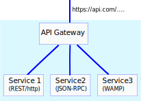
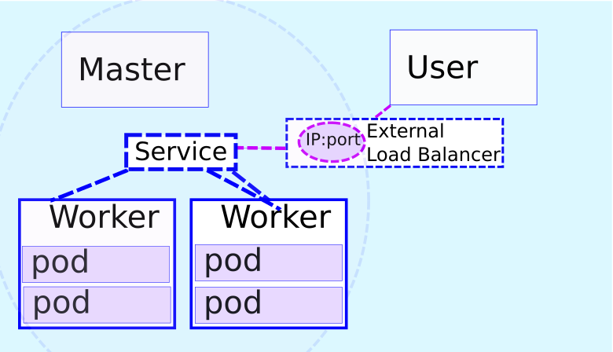
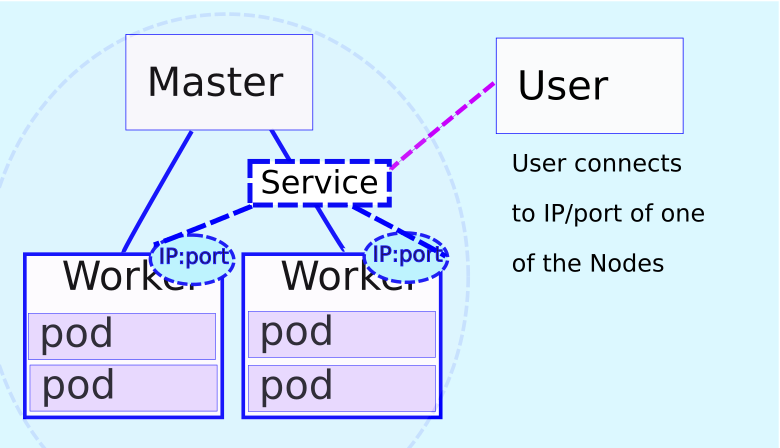
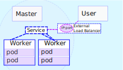
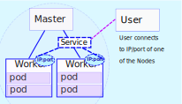

name: separator
layout: true
class: center, top, inverse

<!-- goto a specific slide using e.g.
   url#walign1
or
   [link](#walign1)
-->

<div class="footer"> @mjbright </div>

---
name: nofooter
layout: true
class: center, top, inverse

<!-- NO FOOTER -->

---
name: nofootertl
layout: true
class: left, top, inverse

<!-- NO FOOTER -->

---
name: wseparator
layout: true
class: left, top

<div class="footer"> @mjbright </div>

---
name: wseparatorct
layout: true
class: center, top

<div class="footer"> @mjbright </div>

---
name: sep_image
layout: true
class: center, top, inverse
background-image: url(../../images/grenoble.png)
background-position: center
background-repeat: no-repeat
background-size: contain


<div class="footer"> @mjbright </div>

---
name: standard
layout: true
class: center, top

<div class="footer"> @mjbright </div>

---
template: nofooter
background-color: darkcyan

## Python Micro-services with Kubernetes

## 7 October 2018, Pyconf, Lille

<!--  -->


.listitem[Michael Bright, @mjbright]

<div class="centerfooter"> Slides & source code at <u><a href="https://mjbright.github.io/Talks"> https://mjbright.github.io/Talks </a></u> </div>

---
template: nofootertl
background-color: darkcyan

.listitem[Michael Bright, @mjbright]
<br/>

<!-- class: largebullets, left, top, inverse -->

.smenuitem[ Trainer: Kubernetes, Serverless, Docker, CloudNative ] 

.smenuitem[ Past researcher, dev, team lead, dev advocate ]

.smenuitem[ British, living in France for 25-years ]

.smenuitem[ Docker Community Lead, Python User Group ]

<!-- (12-factor++) -->

.smenuitem[  linkedin.com/in/mjbright  github.com/mjbright ]

---
template: separator
exclude: true
background-color: darkcyan

<pre style="background-color: #fcc; text-align:left; border:1px dashed grey;">
This talk will introduce the notions of micro-service design
patterns and how these can be used to deploy micro-services
to the Kubernetes orchestration platform.

We will look at how Kubernetes can be used to deploy and
expose a service using micro-service components, how this
service can be evolved from one version to the next taking
into account the practical details such as the need for
high-availability, scale, ingress controllers, monitoring,
load-balancing.

Looking at how the service components can be upgraded using
appropriate health checks to assure the successful migration
without loss of service.

The above concepts will be demonstrated using an end-to-end
deployment on kubernetes.
</pre>

---
template: wseparator
class: left, top
# Outline

.menuitem[- Monoliths to Micro-services
]
.menuitem[- Micro-service design patterns
]
.menuitem[- Kubernetes
]
.menuitem[ - Operations
]
.menuitem[ - Demo
]
.menuitem[ - Tools
]

<!--
  - why/what, disadvantages
  - VMs / containers / Serverless / Unikernels
 Exposing Services ]
 - H.A., Scaling, Rolling Upgrade, Strategies, Health Checks
- K8s-demo: comportement based on URL, reduce image size
- Tools
  - Helm (use to install tools)
  - Prometheus
  - Squash
Terminal plugin to slides?
-->

---
template: wseparator
class: left, top
# Outline

.menuitem-sel[- Monoliths to Micro-services
]
.menuitem[- Micro-service design patterns
]
.menuitem[- Kubernetes
]
.menuitem[ - Operations
]
.menuitem[ - Demo
]
.menuitem[ - Tools
]

---
template: wseparator
class: left, top
# First ... a bit of history


--
**Note:** But the future is hybrid ...

???

Remember to say what are micro-services, compared to monolithic apps.

General trend from
- large bulky monolithic software which are
  - running on baremetal or VMs
  - difficult to evolve: rack installation, full upgrades, active/standby
- to smaller components
  - running on baremetal VMs or containers ...
  - which are lighter on resources, demand less administration

Also trends from
- JVM to containers?
- SOAP/XML to REST/JSON


These technology advances have also allowed the move to micro-services.

Why micro-services?

From (but included there as a quote):
https://medium.com/google-cloud/simplifying-microservices-with-istio-in-google-kubernetes-engine-part-i-849555f922b8:

In the past, we had big, monolithic apps that “did it all”.
Easy to build and get 1st version online ->
    waterfall dev + big bang rollout then inc. patches ...
    problems could require rollback of whole application
    cloud scaling of whole app

Microservices are suites of independenty deployable services, often communicating by http.  Each service focuses on 1 functionality (separation of concerns).

Allows independent dev/build/test by small teams working on small code bases.
Can be scaled independently.
Allows polyglot services - may wish to limit number of languages though
(requires dev, test, support capabilities)


---
template: wseparator
class: left, top
# Monoliths to Micro-services

.left-hand[
Monoliths are **deployed, scaled, upgraded, reimplemented** as complete units
]
.right-hand[
.img-33[  ]
]
.left-hand[
Individual &micro;-service components can be **deployed, scaled, upgraded, reimplemented** ...
]
.right-hand[
.img-33[  ]
]

---
template: wseparator
class: left, top
# Advantages of Micro-services

.listitem[ Separation of Concerns - "do one thing well" ]
--


.listitem[ Smaller Projects/teams ]
--


.listitem[ Ease Scaling, Deployment, Testing, Evolution ]
--


.listitem[ Loosely coupled components <!-- (services connected by network) --> ]
--


.listitem[ Allow for composition of new services ]
--


## So are they a panacea?

<!--

## Components can be independently
### - developed/tested by small *focused*  teams
### - scaled
### - upgraded, easing deployments
### - replaced, allowing evolution
## Allow for composition of new services

-->


???

Read Martin Fowler:
https://martinfowler.com/articles/microservices.html

From: https://azure.microsoft.com/en-us/blog/design-patterns-for-microservices/

The goal of microservices is to increase the velocity of application releases, by decomposing the application into small autonomous services that can be deployed independently. A microservices architecture also brings some challenges, and these patterns can help mitigate these challenges. We hope you will find them useful in your own projects. As always, we greatly appreciate your feedback.

Idit Levine: on Hybrid Apps (monol, micro, svrls)
https://medium.com/solo-io/building-hybrid-apps-with-gloo-1eb96579b070

The advantages of running microservices — scale, agility, efficiency — drove their widespread adoption, and the popularization of Kubernetes distros (mainly OpenShift), Cloud Foundry and Mesos. 


---
template: wseparator
class: left, top
# Disadvantages

.listitem[  Greater complexity ]
- Requires orchestration, component <u>version management</u>
- Greater <u>organizational</u> complexity
- Monitoring, debugging, end-2-end test are more difficult
--


.listitem[ More network communication ]
- Network error handling, Performance, Circuit-breakers
--


.listitem[ Still requires best practices ]
- Behaviour and Test-Driven Development, CI/CD
- Documentation of interfaces/APIs, Stable

<!--
Illogical splitting
More network interactions
Data storing and sharing
Compatibility issues
Monitoring and Testing
-->

???

---
template: wseparator
class: left, top
# Outline

.menuitem[- Monoliths to Micro-services
]
.menuitem-sel[- Micro-service design patterns
]
.menuitem[- Kubernetes
]
.menuitem[ - Operations
]
.menuitem[ - Demo
]
.menuitem[ - Tools
]

---
template: wseparator
class: left, top
exclude: true
# Component Design Patterns

as proposed by Microsoft "Design patterns for micro-services"
https://azure.microsoft.com/en-us/blog/design-patterns-for-microservices/

.listitem[Ambassador]

.listitem[Anti-corruption]

.listitem[Backends]

.listitem[Gateway aggregation, offloading, routing]

.listitem[Sidecar]

.listitem[Strangler]

???

[Ambassador](https://docs.microsoft.com/en-US/azure/architecture/patterns/ambassador) can be used to offload common client connectivity tasks such as monitoring, logging, routing, and security (such as TLS) in a language agnostic way.

[Anti-corruption]() layer implements a façade between new and legacy applications, to ensure that the design of a new application is not limited by dependencies on legacy systems.

[Backends]() for Frontends creates separate backend services for different types of clients, such as desktop and mobile. That way, a single backend service doesn’t need to handle the conflicting requirements of various client types. This pattern can help keep each microservice simple, by separating client-specific concerns.

[Bulkhead]() isolates critical resources, such as connection pool, memory, and CPU, for each workload or service. By using bulkheads, a single workload (or service) can’t consume all of the resources, starving others. This pattern increases the resiliency of the system by preventing cascading failures caused by one service.

[Gateway Aggregation]() aggregates requests to multiple individual microservices into a single request, reducing chattiness between consumers and services.

[Gateway Offloading]() enables each microservice to offload shared service functionality, such as the use of SSL certificates, to an API gateway.

[Gateway Routing]() routes requests to multiple microservices using a single endpoint, so that consumers don't need to manage many separate endpoints.

[Sidecar]() deploys helper components of an application as a separate container or process to provide isolation and encapsulation.

[Strangler]() supports incremental migration by gradually replacing specific pieces of functionality with new services.


???

From: https://azure.microsoft.com/en-us/blog/design-patterns-for-microservices/

---
template: wseparator
class: left, top
exclude: true
# Architecture Design Patterns
as proposed by MuleSoft, "The top 6 Microservices Patterns"
https://www.mulesoft.com/lp/whitepaper/api/top-microservices-patterns


.listitem[ Fine-grained SOA ]

.listitem[ Layered APIs ]

.listitem[ Message-Oriented ]

.listitem[ Event-driven ]

.listitem[ Isolating state ]

.listitem[ Replicating state ]

???

---
template: wseparator
class: left, top
exclude: false
# Architecture Design Patterns

.listitem[ Standard Component Patterns ]

.listitem[ Micro-services themselves (!) - Fine-grained SOA ]

.listitem[ Strangler ]

--

<hr/>

.listitem[ API Gateway ]

.listitem[ Service Mesh ]

.listitem[ Hybrid Apps ]

???

---
template: wseparator
class: left, top
# Design Pattern - API Gateway

<table>
<tr>
<td width="33%" />
.img-80[  ]
</td><td>
.slistitem[ External entrypoint exposes APIs ]
</td>
</tr>
</table>

- Offloads common Ingress functions => <u>reduces &micro;-service complexity</u>
  - rate limiting, security, authorisation, DDOS protection
  - Protocol version translation, e.g. REST to SOAP, *-RPC ...
  - TLS decryption/encryption

--


- Hides internal infrastructure detail => <u>controls access</u>
  - service routing, load-balancing
  - Allows to refactor/scale/mock internal implementation

--

.slistitem[ Needs to scale, be H.A. ]

<!-- 
.listitem[ The Drawbacks of an Microservice API Gateway ]
- Requires configuration routing logic
- Needs HA and scaling
-->


???

From:
https://dzone.com/articles/why-do-microservices-need-an-api-gateway

also? http://microservices.io/patterns/apigateway.html
also? 

---
template: wseparator
class: left, top
exclude: true
# Design Pattern - API Gateway

.img-66[  ]

<!--  -->

---
template: wseparator
class: left, top
# Design Pattern - Service Mesh

Abstraction above TCP/IP, secure reliable <u>inter-service</u> connectivity.

Platforms such as Linkerd (v2) and Istio (v1) provide offload for &micro;--services


--
Offloads functionality from services in a distributed way.

--
<!-- .img-66[  ] -->
.img-66[  ]

---
template: wseparator
class: left, top
# Design Pattern - Hybrid Apps

Gloo allows to route between legacy apps, micro-services and serverless incrementally adding new functionality.
.img-66[  ]

https://medium.com/solo-io/building-hybrid-apps-with-gloo-1eb96579b070


---
template: wseparator
class: left, top
# Outline

.menuitem[- Monoliths to Micro-services
]
.menuitem[- Micro-service design patterns
]
.menuitem-sel[- Kubernetes
]
.menuitem[ - Operations
]
.menuitem[ - Demo
]
.menuitem[ - Tools
]

---
template: wseparatorct
class: center, middle, colorheaders
background-image: url(images/OrchestrationPhoto.jpg)

# We need Orchestration

---
template: wseparator
class: left, top

# Kubernetes - Architecture


---
template: wseparator
class: left, top

# Kubernetes - Master Nodes


---
template: wseparator
class: left, top

# Kubernetes - Worker Nodes


---
template: wseparator
class: left, top

# Kubernetes - Pods


---
template: wseparator
class: centre, middle, inverse
background-color: darkcyan

# Kubernetes Demo

<table><tr>
<td>
.img-80[  ]
</td>
<td>
.img-80[  ]
</td>
</tr></table>

---
template: wseparator
class: left, top

## Kubernetes - Deploying Redis


---
template: wseparator
class: left, top

## Kubernetes - Deploying Redis

````console
# kubectl run redis --image=redis:latest --port=6379

$ kubectl apply -f redis-deployment.yaml
deployment.extensions "redis" created

$ kubectl get pods
NAME                     READY     STATUS              RESTARTS   AGE
redis-68595c4d95-rr4pr   0/1       ContainerCreating   0          1s
```
---
template: wseparator
class: left, top

## Kubernetes - Deploying Redis (yaml)

```yaml
apiVersion: extensions/v1beta1
kind: Deployment
metadata:
  labels:
    run: redis
  name: redis
spec:
  replicas: 1
  selector:
    matchLabels:
      run: redis
  template:
    metadata:
      labels:
        run: redis
    spec:
      containers:
      - image: redis:latest
        name: redis
        ports:
        - containerPort: 6379
```

---
template: wseparator
class: left, top

## Kubernetes - Deploying Flask


---
template: wseparator
class: left, top

## Kubernetes - Deploying Flask

```console
# kubectl run flask-app --image=$IMAGE --port=5000

$ kubectl apply -f flask-deployment.yaml
deployment.extensions "flask-app" created

$ kubectl get pods
NAME                        READY     STATUS              RESTARTS   AGE
flask-app-8577b44db-96cht   0/1       Pending             0          1s
redis-68595c4d95-rr4pr      0/1       ContainerCreating   0          1s
```

---
template: wseparator
class: left, top

## Kubernetes - Deploying Flask (yaml)

```yaml
apiVersion: extensions/v1beta1
kind: Deployment
metadata:
  labels:
    run: flask-app
  name: flask-app
spec:
  replicas: 1
  selector:
    matchLabels:
      run: flask-app
  template:
    metadata:
      labels:
        run: flask-app
    spec:
      containers:
      - image: mjbright/flask-web:v1
        name: flask-app
        ports:
        - containerPort: 5000
```

---
template: wseparator
class: left, top

## Kubernetes - Exposing Services


???






---
template: wseparator
class: left, top

## Exposing Services (LoadBalancer)



---
template: wseparator
class: left, top

## Exposing Services (NodePort)




---
template: wseparator
class: left, top
name: ingress

## Exposing Services (IngressController)


---
template: wseparator
class: left, top

## Exposing Redis Service (LoadBalancer)

```console
# kubectl expose deployment redis --type=LoadBalancer

$ kubectl apply -f redis-service.yaml
service "redis" created

$ kubectl get svc
NAME         TYPE           CLUSTER-IP       EXTERNAL-IP   PORT(S)          AGE
kubernetes   ClusterIP      10.96.0.1        <none>        443/TCP          5h
redis        LoadBalancer   10.101.158.201   <pending>     6379:31218/TCP   1s


```


---
template: wseparator
class: left, top

## Exposing Redis Service (LoadBalancer)

```yaml
apiVersion: v1
kind: Service
metadata:
  labels:
    run: redis
  name: redis
spec:
  ports:
  - port: 6379
    protocol: TCP
    targetPort: 6379
  selector:
    run: redis
  type: LoadBalancer
```

---
template: wseparator
class: left, top

## Exposing Flask Service (LoadBalancer)

```console
# kubectl expose deployment flask-app --type=LoadBalancer

$ kubectl apply -f flask-service.yaml
service "flask-app" created

$ kubectl get svc
NAME         TYPE           CLUSTER-IP       EXTERNAL-IP   PORT(S)          AGE
flask-app    LoadBalancer   10.103.154.19    <pending>     5000:32201/TCP   1s
kubernetes   ClusterIP      10.96.0.1        <none>        443/TCP          5h
redis        LoadBalancer   10.101.158.201   <pending>     6379:31218/TCP   2s
```

---
template: wseparator
class: left, top

## Exposing Flask Service (LoadBalancer)

```yaml
apiVersion: v1
kind: Service
metadata:
  labels:
    run: flask-app
  name: flask-app
spec:
  ports:
  - port: 5000
    protocol: TCP
    targetPort: 5000
  selector:
    run: flask-app
  type: LoadBalancer
```

---
template: wseparator
class: left, top
name: ingress2

## Exposing Services (Ingress)

```console
$ minikube addons enable ingress
ingress was successfully enabled

$ kubectl apply -f misc/ingress-definition.yaml        
ingress.extensions "ingress-definitions" created

$ sudo vi /etc/hosts
...
192.168.99.100  minikube.test flaskapp.test
```

---
template: wseparator
class: left, top

## Exposing Services (Ingress)

```yaml
apiVersion: extensions/v1beta1
kind: Ingress
metadata:
  name: ingress-definitions
  annotations:
    nginx.ingress.kubernetes.io/rewrite-target: /
spec:
  backend:
    serviceName: default-http-backend
    servicePort: 80
  rules:
  - host: minikube.test
    http:
      paths:
      - path: /
        backend:
          serviceName: k8sdemo
          servicePort: 8080
  - host: flaskapp.test
    http:
      paths:
      - path: /flask
        backend:
          serviceName: flask-app
          servicePort: 5000
```

---
template: wseparator
class: left, top

## Exposing Services (Ingress)

```console
$ minikube service list
|-------------|----------------------|-----------------------------|
|  NAMESPACE  |         NAME         |             URL             |
|-------------|----------------------|-----------------------------|
| default     | flask-app            | http://192.168.99.100:32201 |
| default     | k8sdemo              | http://192.168.99.100:31280 |
| default     | redis                | http://192.168.99.100:31218 |
| kube-system | kubernetes-dashboard | http://192.168.99.100:30000 |
|-------------|----------------------|-----------------------------|

$ curl http://192.168.99.100:31280

$ curl http://minikube.test/k8sdemo
```

---
template: wseparator
class: left, top

## Exposing Services (Ingress)

```console
$ minikube service list
|-------------|----------------------|-----------------------------|
|  NAMESPACE  |         NAME         |             URL             |
|-------------|----------------------|-----------------------------|
| default     | flask-app            | http://192.168.99.100:32201 |
| default     | k8sdemo              | http://192.168.99.100:31280 |
| default     | redis                | http://192.168.99.100:31218 |
| kube-system | kubernetes-dashboard | http://192.168.99.100:30000 |
|-------------|----------------------|-----------------------------|

$ curl http://192.168.99.100:32201
[flask-app-8577b44db-kbwpn] Redis counter value=214

$ curl http://flaskapp.test/flask
[flask-app-8577b44db-kbwpn] Redis counter value=215
```

---
template: wseparator
class: left, top
# Outline

.menuitem[- Monoliths to Micro-services
]
.menuitem[- Micro-service design patterns
]
.menuitem[- Kubernetes
]
.menuitem-sel[ - Operations
]
.menuitem[ - Demo
]
.menuitem[ - Tools
]

---
template: wseparator
class: left, top
# Operations

<!-- .menuitem[ H.A. ] -->

.menuitem[ Scaling ]

.menuitem[ Rolling Upgrade ]

.menuitem[ Strategies ]

.menuitem[ Health Checks ]

---
template: wseparator
class: left, top
exclude: true
## Operations - achieving High Availability

Achieved through running multiple instances across multiple nodes of the data center

- resilience to node outages

- resilience to pod outages or poor response times

---
template: wseparator
class: left, top
## Operations - Scaling

```console
# kubectl scale deploy flask-app --replicas=4

$ kubectl edit -f flask-deploy.yaml
```

```yaml
...
spec:
  replicas: 4
```

---
template: wseparator
class: left, top
## Operations - Rolling Upgrades

### Several strategies exist

.listitem[ recreate ]
&nbsp;&nbsp;- terminate old version before releasing new one
--


.listitem[ ramped ]
&nbsp;&nbsp;- gradually release a new version on a rolling update fashion
--


.listitem[ blue/green ]
&nbsp;&nbsp;- release new version alongside old version then switch
--


.listitem[ canary ]
&nbsp;&nbsp;- release new version to subset of users, proceed to full rollout
--


.listitem[ a/b testing ]
&nbsp;&nbsp;- release new version to subset of users in a precise way (HTTP headers, cookie, weight, etc.).
<!-- A/B testing is really a technique for making business decisions based on statistics but we will briefly describe the process. This doesn’t come out of the box with Kubernetes, it implies extra work to setup a more advanced infrastructure (Istio, Linkerd, Traefik, custom nginx/haproxy, etc). -->


???

http://container-solutions.com/kubernetes-deployment-strategies/
https://kubernetes.io/docs/concepts/workloads/controllers/deployment/
https://kubernetes.io/docs/tutorials/kubernetes-basics/update-intro/
https://kubernetes.io/docs/tasks/manage-daemon/update-daemon-set/

---
template: wseparator
class: left, top
## Operations - Rolling Upgrade

.listitem[ Ramped ]
```console
# kubectl set image deploy flask-app flask-app=mjbright/flask-web:v2

$ kubectl edit -f flask-deploy.yaml
$ kubectl rollout status deployment/flask-app
```

```yaml
...
    spec:
      containers:
      - image: mjbright/flask-web:v2
```

---
template: wseparator
class: left, top
exclude: true
## Operations - Health Checks


---
template: wseparator
class: left, top
# Outline

.menuitem[- Monoliths to Micro-services
]
.menuitem[- Micro-service design patterns
]
.menuitem[- Kubernetes
]
.menuitem[ - Operations
]
.menuitem-sel[ - Demo
]
.menuitem[ - Tools
]

---
template: wseparator
class: centre, middle, inverse
background-color: darkcyan

# Demo

<table><tr>
<td>
.img-80[  ]
</td>
<td>
.img-80[  ]
</td>
</tr></table>


<!--
- K8s-demo: comportement based on URL, reduce image size
Terminal plugin to slides?
-->

---
template: wseparator
class: left, top
# Outline

.menuitem[- Monoliths to Micro-services
]
.menuitem[- Micro-service design patterns
]
.menuitem[- Kubernetes
]
.menuitem[ - Operations
]
.menuitem[ - Demo
]
.menuitem-sel[ - Tools
]

---
template: wseparator
class: left, top
# Tools

- Tools
  - Helm (use to install tools)
  - Prometheus
  - Squash
  - .green[Gloo]
  - .red[Istio / Service Meshes / Envoy]

.img-25[  ]


---
template: wseparator
exclude:true

#class: largebullets, left, inverse
#background-color: darkcyan

# Summary
## Getting started with Micro-services

.smenuitem[ &micro;-services allow to scale, "best in class" components  ]
.smenuitem[ Transform technology <u>and</u> your organization  ]
.smenuitem[ Take small steps: Strangler, Hybrid approach ]
.smenuitem[ Secure/abstract your services behind API gateway ]

<!--
.smenuitem[ Services must use public APIs only ]
.smenuitem[ Automate, automate, automate ...  ]
-->

---
template: wseparator
class: largebullets, left, inverse
background-color: darkcyan

# Summary

.menuitem[ Micro-services offer new deployment possibilities ]

  ### - with ease of deployment, scaling, upgrading
  ### - facilitate "Best in Class" technology choices/replacements

--

.menuitem[ *BUT* moving to &micro;-services requires ]

  ### - organizational changes and best practices !
  ### - incremental rollout - small steps / Strangler
  ### - hybrid approaches - old/new, cloud/on-premise, VM/container/&micro;-service
  ### - offload via API Gateway and/or Service Mesh


---
template: nofooter
background-color: darkcyan

<br/> <br/> 

# Thank you !

<br/> <br/>

# Questions ?

<br/> <br/> <br/> <br/>

.listitem[Michael Bright, @mjbright]

### Cloud Native Training (Docker, Kubernetes, Serverless)

.smenuitem[  linkedin.com/in/mjbright  github.com/mjbright ]

<div class="centerfooter"> Slides & source code at <u><a href="https://mjbright.github.io/Talks"> https://mjbright.github.io/Talks </a></u> </div>

---
template: wseparator
class: largebullets, left, inverse
background-color: darkcyan

# Summary
## Getting started with Kubernetes

.menuitem[ Start by learning Docker principles ]

.menuitem[ Experiment by Dockerizing some applications ]

.menuitem[ Learn about Container Orchestration ]

.menuitem[ Hands-on with Kubernetes online or Minikube(<b>*</b>) ]


---
template: wseparator
class: largebullets, middle, inverse
background-color: darkcyan
name: resources_minikube

# Resources

<!--  -->
.img-33[  ]

| | |
|----------|----------|
| Download | https://github.com/kubernetes/minikube/releases
| Documentation | https://kubernetes.io/docs/getting-started-guides/minikube/
| Hello Minikube | https://kubernetes.io/docs/tutorials/stateless-application/hello-minikube/

<div class="wleftfooter"> Slides & source code at <u><a href="https://mjbright.github.io/Talks"> https://mjbright.github.io/Talks </a></u> </div>
---
template: wseparator
class: largebullets, middle, inverse
background-color: darkcyan
name: resources

# Resources - Articles

| | |
|----------|----------|
| Martin Fowler  | https://martinfowler.com/articles/microservices.html
| MuleSoft, "The top 6 Microservices Patterns"  | https://www.mulesoft.com/lp/whitepaper/api/top-microservices-patterns
| FullStack Python  | https://www.fullstackpython.com/microservices.html
| Idit Levine     | https://medium.com/solo-io/building-hybrid-apps-with-gloo-1eb96579b070
| SSola     | https://medium.com/@ssola/building-microservices-with-python-part-i-5240a8dcc2fb
| Deployment | http://container-solutions.com/kubernetes-deployment-strategies/

<div class="wleftfooter"> Slides & source code at <u><a href="https://mjbright.github.io/Talks"> https://mjbright.github.io/Talks </a></u> </div>
---
template: wseparator
class: largebullets, middle, inverse
background-color: darkcyan
name: resources2

# Resources - Books
| Publisher |    | Title, Author
|----------|----|-----------
| O'Reilly | .img-25[  ] | "Building Microservices", Sam Newman, July 2015
| PacktPub | .img-25[  ] | "Python Microservices Development", [Tarek Ziade](https://ziade.org/2017/07/26/python-microservices-development/), July 2017

<!-- https://www.packtpub.com/web-development/python-microservices-development 
-->
<div class="wleftfooter"> Slides & source code at <u><a href="https://mjbright.github.io/Talks"> https://mjbright.github.io/Talks </a></u> </div>

