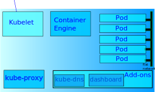
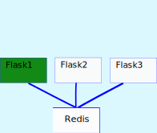
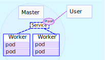
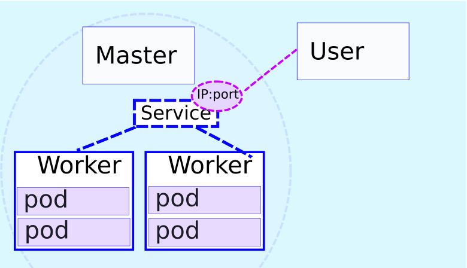
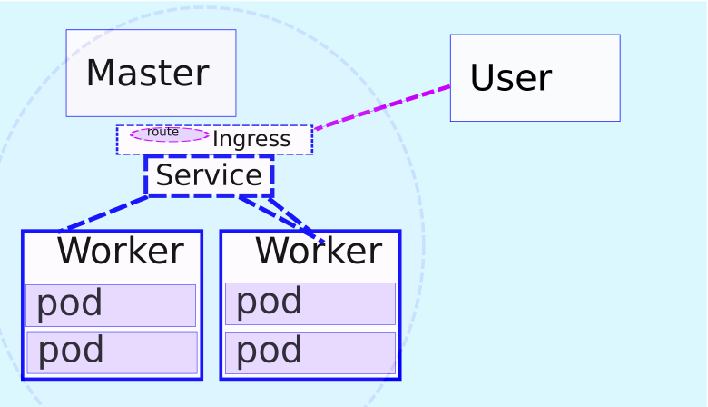

name: separator
layout: true
class: center, top, inverse

<!-- goto a specific slide using e.g.
   url#walign1
or
   [link](#walign1)
-->

<div class="footer"> @mjbright </div>

---
name: nofooter
layout: true
class: center, top, inverse

<!-- NO FOOTER -->

---
name: nofootertl
layout: true
class: left, top, inverse

<!-- NO FOOTER -->

---
name: wseparator
layout: true
class: left, top

<div class="footer"> @mjbright </div>

---
name: wseparatorct
layout: true
class: center, top

<div class="footer"> @mjbright </div>

---
name: sep_image
layout: true
class: center, top, inverse
background-image: url(../../images/grenoble.png)
background-position: center
background-repeat: no-repeat
background-size: contain


<div class="footer"> @mjbright </div>

---
name: standard
layout: true
class: center, top

<div class="footer"> @mjbright </div>

---
template: nofooter
background-color: darkcyan

## From Monolith to Micro-services with Kubernetes

## 16 Mar 2019, FOSS Asia, Singapore

<!--  -->
.img-10[  ]
<br/>
.img-75[  ]

.listitem[Michael Bright, @mjbright]

<div class="centerfooter"> Slides & source code at <u><a href="https://mjbright.github.io/Talks"> https://mjbright.github.io/Talks </a></u> </div>

---
template: nofooter
background-color: darkcyan
exclude: true

## TEST PAGE


<div class="container">
  <!--  -->
.img-50[  ]
  <div class="br-text-block"> 
    <h4>BR-Nature</h4>
    <p>What a beautiful sunrise</p>
  </div>
  <div class="tr-text-block"> 
    <h4>TR-Nature</h4>
    <p>What a beautiful sunrise</p>
  </div>
  <div class="tl-text-block"> 
    <h4>TL-Nature</h4>
    <p>What a beautiful sunrise</p>
  </div>
  <div class="bl-text-block"> 
    <h4>BL-Nature</h4>
    <p>What a beautiful sunrise</p>
  </div>
  <div class="cm-text-block"> 
    <h4>CM-Nature</h4>
    <p>What a beautiful sunrise</p>
  </div>
</div>

<style>
/* Container holding the image and the text */
.container {
  position: relative;
}

/* center text */
.cm-text-block {
  /*position: absolute; */
  text-align: center;
  vertical-align: middle;
  bottom: 20px;
  left: 20px;
  background-color: #90d090;
  color: white;
  padding-left: 20px;
  padding-right: 20px;
}
/* Bottom left text */
.bl-text-block {
  position: absolute;
  bottom: 20px;
  left: 20px;
  background-color: #90d090;
  color: white;
  padding-left: 20px;
  padding-right: 20px;
}

/* Top left text */
.tl-text-block {
  position: absolute;
  bottom: 120px;
  left: 20px;
  background-color: #90d090;
  color: white;
  padding-left: 20px;
  padding-right: 20px;
}
/* Bottom right text */
.br-text-block {
  position: absolute;
  bottom: 20px;
  right: 20px;
  background-color: #90d090;
  color: white;
  padding-left: 20px;
  padding-right: 20px;
}

/* Top right text */
.tr-text-block {
  position: absolute;
  bottom: 120px;
  right: 20px;
  background-color: #90d090;
  color: white;
  padding-left: 20px;
  padding-right: 20px;
}
</style>


---
template: nofootertl
background-color: darkcyan

.listitem[Michael Bright, @mjbright]
<br/>

<!-- class: largebullets, left, top, inverse -->

.smenuitem[ Freelance Consultant & Trainer on CloudNative Solutions ] 

.smenuitem[ Past researcher, dev, team lead, dev advocate ]

.smenuitem[ British, living in France for 27-years ]

.smenuitem[ Docker Community Lead, Python User Group ]

<!-- (12-factor++) -->

.smenuitem[  linkedin.com/in/mjbright &nbsp;&nbsp;   github.com/mjbright ]

---
template: separator
exclude: true
background-color: darkcyan

<pre style="background-color: #fcc; text-align:left; border:1px dashed grey;">
This talk will introduce the notions of micro-service design
patterns and how these can be used to deploy micro-services
to the Kubernetes orchestration platform.

We will look at how Kubernetes can be used to deploy and
expose a service using micro-service components, how this
service can be evolved from one version to the next taking
into account the practical details such as the need for
high-availability, scale, ingress controllers, monitoring,
load-balancing.

Looking at how the service components can be upgraded using
appropriate health checks to assure the successful migration
without loss of service.

The above concepts will be demonstrated using an end-to-end
deployment on kubernetes.
</pre>

---
template: wseparator
class: left, top
# Outline

.menuitem[- [Why?] Monoliths to Micro-services
]
.menuitem[- Orchestration: Kubernetes
]
.menuitem[- Deployment Strategies
]
.menuitem[- Architecture Design patterns
]
.menuitem[- Summary
]

<!--
  - why/what, disadvantages
  - VMs / containers / Serverless / Unikernels
 Exposing Services ]
 - H.A., Scaling, Rolling Upgrade, Strategies, Health Checks
- K8s-demo: comportement based on URL, reduce image size
- Tools
  - Helm (use to install tools)
  - Prometheus
  - Squash
Terminal plugin to slides?
-->

---
template: wseparator
class: left, top
# Outline

.menuitem-sel[- [Why?] Monoliths to Micro-services
]
.menuitem[- Orchestration: Kubernetes
]
.menuitem[- Deployment Strategies
]
.menuitem[- Architecture Design patterns
]
.menuitem[- Summary
]

---
template: wseparator
class: left, top
# First ... a bit of history


---
template: wseparator
class: left, top
# First ... a bit of history

  <!--  -->
  
<div class="container">
  <div class="tl-text-block"> 
    <b>Note:</b> The future will be hybrid ... (technologies, providers, on-prem/cloud ...)
  </div>
</div>
  </img>


???

Remember to say what are micro-services, compared to monolithic apps.

General trend from
- large bulky monolithic software which are
  - running on baremetal or VMs
  - difficult to evolve: rack installation, full upgrades, active/standby
- to smaller components
  - running on baremetal VMs or containers ...
  - which are lighter on resources, demand less administration

Also trends from
- JVM to containers?
- SOAP/XML to REST/JSON


These technology advances have also allowed the move to micro-services.

Why micro-services?

From (but included there as a quote):
https://medium.com/google-cloud/simplifying-microservices-with-istio-in-google-kubernetes-engine-part-i-849555f922b8:

In the past, we had big, monolithic apps that “did it all”.
Easy to build and get 1st version online ->
    waterfall dev + big bang rollout then inc. patches ...
    problems could require rollback of whole application
    cloud scaling of whole app

Microservices are suites of independenty deployable services, often communicating by http.  Each service focuses on 1 functionality (separation of concerns).

Allows independent dev/build/test by small teams working on small code bases.
Can be scaled independently.
Allows polyglot services - may wish to limit number of languages though
(requires dev, test, support capabilities)


---
template: wseparator
class: left, top
# [Why?] Monoliths to Micro-services

.left-hand[
Traditionally software has been delivered as large packages which can only be ** *deployed, scaled, upgraded, reimplemented* ** as a whole.
]
.right-hand[
.img-66[  ]
]

** Problem: A paradigm ill-adapted to enterprise or *web-scale* **
--

- Tightly-coupled components exist as a unit, are difficult to reuse
- Waterfall release cycles make software difficult to patch
- Difficult to innovate due to slow release cycles

---
template: wseparator
class: left, top
# Monoliths to Micro-services

** Micro-services use small loosely-coupled software components **
.left-hand[
Individual components can be ** *deployed, scaled, upgraded, replaced* ** ...
]
.right-hand[
.img-33[  ]
]

Micro-service architecture components are lightly-coupled
- interconnected by network
- can be scaled independently
- can be deployed/upgraded independently

---
template: wseparator
class: left, top
# Advantages of Micro-services

.listitem[ Separation of Concerns: "do one thing well" ]
--


.listitem[ Smaller *focussed* Projects/teams ]
--


.listitem[ Ease Scaling, Deployment, Testing, Evolution ]
--


<!-- 
.listitem[ Loosely-coupled components <!-- (services connected by network) - ]
  --
-->


.listitem[ Allow for composition of new services ]
--


.listitem[ Can be re-implemented with "*Best in class*" tech]


--


## So are they a panacea?

<!--

## Components can be independently
### - developed/tested by small *focused*  teams
### - scaled
### - upgraded, easing deployments
### - replaced, allowing evolution
## Allow for composition of new services

-->


???

Read Martin Fowler:
https://martinfowler.com/articles/microservices.html

From: https://azure.microsoft.com/en-us/blog/design-patterns-for-microservices/

The goal of microservices is to increase the velocity of application releases, by decomposing the application into small autonomous services that can be deployed independently. A microservices architecture also brings some challenges, and these patterns can help mitigate these challenges. We hope you will find them useful in your own projects. As always, we greatly appreciate your feedback.

Idit Levine: on Hybrid Apps (monol, micro, svrls)
https://medium.com/solo-io/building-hybrid-apps-with-gloo-1eb96579b070

The advantages of running microservices — scale, agility, efficiency — drove their widespread adoption, and the popularization of Kubernetes distros (mainly OpenShift), Cloud Foundry and Mesos. 


---
template: wseparator
class: left, top
# Disadvantages

.listitem[  Greater complexity ]
- Require orchestration, and rigorous component <u>version management</u>
- Need to *evolve* to greater <u>organizational</u> complexity
- Monitoring, debugging, end-2-end test are more difficult
--


.listitem[ Network communication is critical ]
- Need good error handling, Performance, Circuit-breakers
--


.listitem[ Useless without adopting best practices ]
- Behaviour and Test-Driven Development, CI/CD
- Require rigorous documentation of interfaces/APIs
- Stable APIs and backward-compatibility support

<!--
Illogical splitting
More network interactions
Data storing and sharing
Compatibility issues
Monitoring and Testing
-->

???

---
template: wseparator
class: left, top
# Outline

.menuitem[- [Why?] Monoliths to Micro-services
]
.menuitem-sel[- Orchestration: Kubernetes
]
.menuitem[- Deployment Strategies
]
.menuitem[- Architecture Design patterns
]
.menuitem[- Summary
]

---
template: wseparator
class: left, top
# Orchestration: Kubernetes

** Problem: As our systems scale ** it becomes impossible to manage 1000's of diverse containers running across a data center of 100's of nodes.
- on which nodes should you schedule?
  - to ensure availability
  - to satisfy affinity, non-affinity constraints
  - to take advantage of specialized h/w
--

- which containers are malfunctioning?
--

- which are started and ready to go?
--

- how to easily upgrade applications?
--

- how to auto-scale applications?

---
template: wseparatorct
class: center, middle, colorheaders
background-image: url(images/OrchestrationPhoto.jpg)

# We need Orchestration

???

REPLACE: As you move from deploying containers on a single machine to deploying them across a number of machines, you'll need an orchestration tool to manage (and automate) the arrangement, coordination, and availability of the containers across the entire system.

REPLACE: Issues:
- Cross-server container communication
- Horizontal scaling
- Service discovery
- Security/TLS
- Zero-downtime deploys
- Rollbacks

---
template: wseparator
class: left, top

# Orchestration Feature Wish-list

- **Health checks**           - to Verify when a task is ready to accept traffic
- **Dynamic port-mapping**           - Ports are assigned dynamically when a new container is spun up
- **Zero-downtime deployments** -           Deployments do not disrupt end users
- **Service discovery** -           Automatic detection of new containers and services
- **Auto scaling** -           Automatically scale resources up or down based on the load
- **Provisioning**           - New containers should select hosts based on resources and configuration

- **Other**    -  Load balancing, logging, monitoring, authentication and authorization, security... predictability, scalability, and high availability...

---
template: wseparator
class: left, top

# Kubernetes - Architecture


---
template: wseparator
class: left, top

# Kubernetes - Master Nodes


---
template: wseparator
class: left, top

# Kubernetes - Worker Nodes



---
template: wseparator
class: left, top

# Kubernetes - Pods


---
template: wseparator
class: centre, middle, inverse
background-color: darkcyan

# Kubernetes Demo

<table><tr>
<td>
.img-80[  ]
</td>
<td>
.img-80[  ]
</td>
</tr></table>

---
template: wseparator
class: left, top

## Kubernetes - Deploying Redis


---
template: wseparator
class: left, top

## Kubernetes - Deploying Redis

````console
# kubectl run redis --image=redis:latest --port=6379

$ kubectl apply -f redis-deployment.yaml
deployment.extensions "redis" created

$ kubectl get pods
NAME                     READY     STATUS              RESTARTS   AGE
redis-68595c4d95-rr4pr   0/1       ContainerCreating   0          1s
```
---
template: wseparator
class: left, top

## Kubernetes - Deploying Redis (yaml)

```yaml
apiVersion: extensions/v1beta1
kind: Deployment
metadata:
  labels:
    run: redis
  name: redis
spec:
  replicas: 1
  selector:
    matchLabels:
      run: redis
  template:
    metadata:
      labels:
        run: redis
    spec:
      containers:
      - image: redis:latest
        name: redis
        ports:
        - containerPort: 6379
```

---
template: wseparator
class: left, top

## Kubernetes - Deploying Flask


---
template: wseparator
class: left, top

## Kubernetes - Deploying Flask

```console
# kubectl run flask-app --image=$IMAGE --port=5000

$ kubectl apply -f flask-deployment.yaml
deployment.extensions "flask-app" created

$ kubectl get pods
NAME                        READY     STATUS              RESTARTS   AGE
flask-app-8577b44db-96cht   0/1       Pending             0          1s
redis-68595c4d95-rr4pr      0/1       ContainerCreating   0          1s
```

---
template: wseparator
class: left, top

## Kubernetes - Deploying Flask (yaml)

```yaml
apiVersion: extensions/v1beta1
kind: Deployment
metadata:
  labels:
    run: flask-app
  name: flask-app
spec:
  replicas: 1
  selector:
    matchLabels:
      run: flask-app
  template:
    metadata:
      labels:
        run: flask-app
    spec:
      containers:
      - image: mjbright/flask-web:v1
        name: flask-app
        ports:
        - containerPort: 5000
```

---
template: wseparator
class: left, top
## Operations - Scaling

```console
# kubectl scale deploy flask-app --replicas=4

$ kubectl edit -f flask-deploy.yaml
```

```yaml
...
spec:
  replicas: 4
```

---
template: wseparator
class: left, top

## Kubernetes - Scaling Flask (yaml)

```yaml
apiVersion: extensions/v1beta1
kind: Deployment
metadata:
  labels:
    run: flask-app
  name: flask-app
spec:
  replicas: 4
  selector:
    matchLabels:
      run: flask-app
  template:
    metadata:
      labels:
        run: flask-app
    spec:
      containers:
      - image: mjbright/flask-web:v1
        name: flask-app
        ports:
        - containerPort: 5000
```

---
template: wseparator
class: left, top

## Kubernetes - Scaling Flask

```console
$ kubectl apply -f flask-deployment-r4-v1.yaml
deployment.extensions "flask-app" created

$ kubectl get pods
NAME                        READY     STATUS              RESTARTS   AGE
flask-app-8577b44db-96cht   1/4       Pending             0          1h
redis-68595c4d95-rr4pr      1/1       Running             0          1h
```

---
template: wseparator
class: left, top
# Outline

.menuitem[- [Why?] Monoliths to Micro-services
]
.menuitem[- Orchestration: Kubernetes
]
.menuitem-sel[- Deployment Strategies
]
.menuitem[- Architecture Design patterns
]
.menuitem[- Summary
]
---
template: wseparator
class: left, top
# Deployment Strategies

** Problem:** How can we simply/automatically upgrade micro-services ?
- across a data center

- in the cloud
--


** Solution:** Several deployment strategies exist

- Some strategies can be implemented by Kubernetes alone


- Some strategies must be handled by external routing


---
template: wseparator
class: left, top
exclude: false
# Micro-service Deployment Strategies

.menuitem[ Service Upgrade Strategies ]

.menuitem[ Health Checks ]

.menuitem[ Strangler Pattern - migration pattern ]


---
template: wseparator
class: left, top
exclude: true
## Operations - achieving High Availability

Achieved through running multiple instances across multiple nodes of the data center

- resilience to node outages

- resilience to pod outages or poor response times

---
template: wseparator
class: left, top
## Operations - Service Upgrade Strategies

### Several strategies exist

Ref: [*Kubernetes deployment strategies, Container Solutions*](https://container-solutions.com/kubernetes-deployment-strategies/), [github](https://github.com/ContainerSolutions/k8s-deployment-strategies)


.listitem[ recreate ]
&nbsp;&nbsp;- terminate old version before releasing new one
--


.listitem[ ramped ]
&nbsp;&nbsp;- gradually release a new version on a rolling update fashion
--


.listitem[ blue/green ]
&nbsp;&nbsp;- release new version alongside old version then switch
--


.listitem[ canary ]
&nbsp;&nbsp;- release new version to subset of users, proceed to full rollout
--


.listitem[ a/b testing ]
&nbsp;&nbsp;- release new version to subset of users in a precise way (HTTP headers, cookie, weight, etc.).
<!-- A/B testing is really a technique for making business decisions based on statistics but we will briefly describe the process. This doesn’t come out of the box with Kubernetes, it implies extra work to setup a more advanced infrastructure (Istio, Linkerd, Traefik, custom nginx/haproxy, etc). -->


???

http://container-solutions.com/kubernetes-deployment-strategies/
https://kubernetes.io/docs/concepts/workloads/controllers/deployment/
https://kubernetes.io/docs/tutorials/kubernetes-basics/update-intro/
https://kubernetes.io/docs/tasks/manage-daemon/update-daemon-set/

---
template: wseparator
class: left, top
## Operations - Service Upgrade Strategies

.listitem[ Ramped ]
```console
# kubectl set image deploy flask-app flask-app=mjbright/flask-web:v2

$ kubectl edit -f flask-deploy.yaml
$ kubectl rollout status deployment/flask-app
```

```yaml
...
    spec:
      containers:
      - image: mjbright/flask-web:v2
```

---
template: wseparator
class: centre, middle, inverse
background-color: darkcyan

# Demo

<table><tr>
<td>
.img-80[  ]
</td>
<td>
.img-80[  ]
</td>
</tr></table>


---
template: wseparator
class: left, top
# Containers - Are you healthy, ready ?

** Problem: ** But how can the system determine if a Service is healthy and available

We'd like the system to not route traffic to unhealthy service instances.
--


** Kubernetes Healthchecks (Liveness and Readiness probes)** provide a solution.

Ref: [Kubernetes Liveness, Readiness Probes Documentation](https://kubernetes.io/docs/tasks/configure-pod-container/configure-liveness-readiness-probes/)

- Liveness probe can be used to force re-creation of blocked image

- Readiness probe can be used to await startup


---
template: wseparator
class: left, top

## Operations - Healthchecks

## Liveness probes

- This probe is used to establish if the container is healthy

   (or blocked, unable to progress).

- The probe can specify
  - A command to execute
  - An http request to try
  - A TCP request to try
--


## Readiness probes

- Once started the container still needs time before being able to accept traffic
- This probe tests the readiness to receive and process requests

- Probe types are as for Liveness probes


---
template: wseparator
class: left, top

## Operations - Liveness probes

```yaml
apiVersion: v1
kind: Pod
metadata:
  labels:
    test: liveness
  name: liveness-exec
spec:
  containers:
  - name: liveness
    image: k8s.gcr.io/busybox
    args:
    - /bin/sh
    - -c
    - touch /tmp/healthy; sleep 30; rm -rf /tmp/healthy; sleep 600
    livenessProbe:
      exec:
        command:
        - cat
        - /tmp/healthy
      initialDelaySeconds: 5
      periodSeconds: 5
```

---
template: wseparator
class: left, top
## Operations - Readiness probes

It is sufficient to replace 'livenessProbe:' by 'readinessProbe:' in the yaml


```yaml
readinessProbe:
  exec:
    command:
    - cat
    - /tmp/healthy
  initialDelaySeconds: 5
  periodSeconds: 5
```

---
template: wseparator
class: left, top

# How to Migrate to Micro-services ?

** Problem:** We may not have the luxury of a *Greenfield* deployment !!

So how can we migrate an existing Monolith to Micro-services ?
--


It's a monolith after all !
--


Do we wait 6 months before having a new implementation

    (*with no extra features!*) ?
--


The ** Strangler ** Pattern provides a possible solution.


---
template: wseparator
class: left, top
## Migration - Strangler Pattern

The Strangler is a pattern used in the initial migration from a Monolithic architecture to a Micro-services architecture

Ref: [Azure Docs - "*Strangler pattern*"](https://docs.microsoft.com/en-us/azure/architecture/patterns/strangler)


---
template: wseparator
class: left, top
exclude: true

# Component Design Patterns

as proposed by Microsoft "Design patterns for micro-services"
https://azure.microsoft.com/en-us/blog/design-patterns-for-microservices/

.listitem[Ambassador]

.listitem[Anti-corruption]

.listitem[Backends]

.listitem[Gateway aggregation, offloading, routing]

.listitem[Sidecar]

.listitem[Strangler]

???

[Ambassador](https://docs.microsoft.com/en-US/azure/architecture/patterns/ambassador) can be used to offload common client connectivity tasks such as monitoring, logging, routing, and security (such as TLS) in a language agnostic way.

[Anti-corruption]() layer implements a façade between new and legacy applications, to ensure that the design of a new application is not limited by dependencies on legacy systems.

[Backends]() for Frontends creates separate backend services for different types of clients, such as desktop and mobile. That way, a single backend service doesn’t need to handle the conflicting requirements of various client types. This pattern can help keep each microservice simple, by separating client-specific concerns.

[Bulkhead]() isolates critical resources, such as connection pool, memory, and CPU, for each workload or service. By using bulkheads, a single workload (or service) can’t consume all of the resources, starving others. This pattern increases the resiliency of the system by preventing cascading failures caused by one service.

[Gateway Aggregation]() aggregates requests to multiple individual microservices into a single request, reducing chattiness between consumers and services.

[Gateway Offloading]() enables each microservice to offload shared service functionality, such as the use of SSL certificates, to an API gateway.

[Gateway Routing]() routes requests to multiple microservices using a single endpoint, so that consumers don't need to manage many separate endpoints.

[Sidecar]() deploys helper components of an application as a separate container or process to provide isolation and encapsulation.

[Strangler]() supports incremental migration by gradually replacing specific pieces of functionality with new services.


???

From: https://azure.microsoft.com/en-us/blog/design-patterns-for-microservices/

https://www.martinfowler.com/bliki/StranglerApplication.html


---
template: wseparator
class: left, top
exclude: true
# Micro-service - Architecture Design Patterns
as proposed by MuleSoft, "The top 6 Microservices Patterns"
https://www.mulesoft.com/lp/whitepaper/api/top-microservices-patterns


.listitem[ Fine-grained SOA ]

.listitem[ Layered APIs ]

.listitem[ Message-Oriented ]

.listitem[ Event-driven ]

.listitem[ Isolating state ]

.listitem[ Replicating state ]

???


---
template: wseparator
class: left, top
exclude: false
## Micro-service - Architecture Design Patterns

Here, we are not concerned with:

.listitem[ Standard Component *Design Patterns* ]


.listitem[ Micro-services themselves (!) - Fine-grained SOA ]


.listitem[ Sidecar ]

---
template: wseparator
class: left, top
exclude: false
## Micro-service - Architecture Design Patterns

We are concerned with:

.listitem[ Exposing Services ]

.listitem[ Ingress ]

providing access to the Kubernetes cluster ...
--


and ways of providing offload-functionality


.listitem[ API Gateway ]

.listitem[ Service Mesh ]

.listitem[ Hybrid Apps - "API Gateway Pattern" ]
--


**Note: ** This is the new war-zone as API Gateways battle it out, Service Meshes battle it out and both battle it out!

???

---
template: wseparator
class: left, top
# Accessing our Services

** Problem:** We've deployed, scaled & upgraded Services across our Cluster
--


But how do we access those services ?
--


- We can access the Pods/containers directly at their **IP** and **port** addresses
--


**Don't !! ** -  they are *ephemereal*
--


- What happens if a Pod dies ... *it just might happen ;-)*
--


(**it's a joke**: it **will** happen)
--


- Also - we don't want to **expose our infrastructure details !!** 
--


- Also - they should be on isolated networks 
--

 
**So** we provide *well-known endpoints* to reliably/safely **expose services**


---
template: wseparator
class: left, top

## Kubernetes - Exposing Services

The general pattern is to provide a *cluster-wide, well-known endpoint* which remains available as Pods come and go



???





---
template: wseparator
class: left, top
# Design Pattern - Services

Services can be exposed via

.listitem[ NodePort ]

.listitem[ HostPort ]

.listitem[ ClusterIP ]

.listitem[ LoadBalancer ]

---
template: wseparator
class: left, top

## Exposing Services (NodePort)


---
template: wseparator
class: left, top

## Exposing Services (LoadBalancer)


---
template: wseparator
class: left, top
name: ingress

## Exposing Services (IngressController)


---
template: wseparator
class: left, top

## Exposing Redis Service (LoadBalancer)

```console
# kubectl expose deployment redis --type=LoadBalancer

$ kubectl apply -f redis-service.yaml
service "redis" created

$ kubectl get svc
NAME         TYPE           CLUSTER-IP       EXTERNAL-IP   PORT(S)          AGE
kubernetes   ClusterIP      10.96.0.1        <none>        443/TCP          5h
redis        LoadBalancer   10.101.158.201   <pending>     6379:31218/TCP   1s


```


---
template: wseparator
class: left, top

## Exposing Redis Service (LoadBalancer)

```yaml
apiVersion: v1
kind: Service
metadata:
  labels:
    run: redis
  name: redis
spec:
  ports:
  - port: 6379
    protocol: TCP
    targetPort: 6379
  selector:
    run: redis
  type: LoadBalancer
```

---
template: wseparator
class: left, top

## Exposing Flask Service (LoadBalancer)

```console
# kubectl expose deployment flask-app --type=LoadBalancer

$ kubectl apply -f flask-service.yaml
service "flask-app" created

$ kubectl get svc
NAME         TYPE           CLUSTER-IP       EXTERNAL-IP   PORT(S)          AGE
flask-app    LoadBalancer   10.103.154.19    <pending>     5000:32201/TCP   1s
kubernetes   ClusterIP      10.96.0.1        <none>        443/TCP          5h
redis        LoadBalancer   10.101.158.201   <pending>     6379:31218/TCP   2s
```

---
template: wseparator
class: left, top

## Exposing Flask Service (LoadBalancer)

```yaml
apiVersion: v1
kind: Service
metadata:
  labels:
    run: flask-app
  name: flask-app
spec:
  ports:
  - port: 5000
    protocol: TCP
    targetPort: 5000
  selector:
    run: flask-app
  type: LoadBalancer
```

---
template: wseparator
class: centre, middle, inverse
background-color: darkcyan
exclude: true

# Demo

<table><tr>
<td>
.img-80[  ]
</td>
<td>
.img-80[  ]
</td>
</tr></table>


---
template: wseparator
class: left, top
# Design Pattern - Ingress

**Ingress** is the general term for controlling *incoming* traffic

    (and *Egress* is the term for *outgoing* traffic)
--


In the context of Kubernetes it refers to the ability (limited feature set) to control
incoming traffic.
See [Kubernetes Docs - Ingress](https://kubernetes.io/docs/concepts/services-networking/ingress/)
--


A set of **Ingress Rules** is specified to be implemented by a **Kubernetes Controller** which typically
implements Load Balancer, Gateway features.

There are many projects providing such controller functionality such as *Nginx*, *HAproxy*, *Ambassador*, *Gloo*, *Traefik*


---
template: wseparator
class: left, top
name: ingress2

## Exposing Services (Ingress)

```console
$ minikube addons enable ingress
ingress was successfully enabled

$ kubectl apply -f misc/ingress-definition.yaml        
ingress.extensions "ingress-definitions" created

$ sudo vi /etc/hosts
...
192.168.99.100  minikube.test flaskapp.test
```

---
template: wseparator
class: left, top

## Exposing Services (Ingress)

```yaml
apiVersion: extensions/v1beta1
kind: Ingress
metadata:
  name: ingress-definitions
  annotations:
    nginx.ingress.kubernetes.io/rewrite-target: /
spec:
  backend:
    serviceName: default-http-backend
    servicePort: 80
  rules:
  - host: minikube.test
    http:
      paths:
      - path: /
        backend:
          serviceName: k8sdemo
          servicePort: 8080
  - host: flaskapp.test
    http:
      paths:
      - path: /flask
        backend:
          serviceName: flask-app
          servicePort: 5000
```

---
template: wseparator
class: left, top

## Exposing Services (Ingress)

```console
$ minikube service list
|-------------|----------------------|-----------------------------|
|  NAMESPACE  |         NAME         |             URL             |
|-------------|----------------------|-----------------------------|
| default     | flask-app            | http://192.168.99.100:32201 |
| default     | k8sdemo              | http://192.168.99.100:31280 |
| default     | redis                | http://192.168.99.100:31218 |
| kube-system | kubernetes-dashboard | http://192.168.99.100:30000 |
|-------------|----------------------|-----------------------------|

$ curl http://192.168.99.100:31280

$ curl http://minikube.test/k8sdemo
```

---
template: wseparator
class: left, top

## Exposing Services (Ingress)

```console
$ minikube service list
|-------------|----------------------|-----------------------------|
|  NAMESPACE  |         NAME         |             URL             |
|-------------|----------------------|-----------------------------|
| default     | flask-app            | http://192.168.99.100:32201 |
| default     | k8sdemo              | http://192.168.99.100:31280 |
| default     | redis                | http://192.168.99.100:31218 |
| kube-system | kubernetes-dashboard | http://192.168.99.100:30000 |
|-------------|----------------------|-----------------------------|

$ curl http://192.168.99.100:32201
[flask-app-8577b44db-kbwpn] Redis counter value=214

$ curl http://flaskapp.test/flask
[flask-app-8577b44db-kbwpn] Redis counter value=215
```

---
template: wseparator
class: centre, middle, inverse
background-color: darkcyan
exclude: true

# Demo (BUG)

<table><tr>
<td>
.img-80[  ]
</td>
<td>
.img-80[  ]
</td>
</tr></table>


---
template: wseparator
class: left, top
# Design Pattern - API Gateway

<!-- Ref: ["*Pattern: API Gateway / Backend for Front-End*"](https://microservices.io/patterns/apigateway.html) -->

Ref: ["*What is an API Gateway?*"](https://apifriends.com/api-security/api-gateway-definition/)

Classic API Gateways date back to Web Service (SOAP APIs) which offloaded Ingress functions into a single system.

API Gateways are API proxies between the client (API consumer) and server (API Provider).

- API Security
<!-- Authentication, Authorization, filtering, forwarding, Encryption, Key/cert management: to offload backends. -->

- API Control and governance
<!-- Quota management, traffic throttling, load-balancing content-based routing, SLA monitoring. -->

- API Monitoring

- API Administration

- API Transformation: See "*API Gateway Pattern*"
<!-- Lightweight ESB or API Orchestration tools - translation between protocols, routing -->


---
template: wseparator
class: left, top
# Design Pattern - API Gateway

<table>
<tr>
<td width="33%" />
.img-80[  ]
</td><td>
.slistitem[ External entrypoint exposes APIs ]
</td>
</tr>
</table>

- Offloads common Ingress functions => <u>reduces &micro;-service complexity</u>
  - rate limiting, security, authorisation, DDOS protection
  - Protocol version translation, e.g. REST to SOAP, *-RPC ...
  - TLS decryption/encryption

- Hides internal infrastructure detail => <u>controls access</u>
  - service routing, load-balancing
  - Allows to refactor/scale/mock internal implementation

--

.slistitem[ Needs to scale, be H.A. ]

<!-- 
.listitem[ The Drawbacks of an Microservice API Gateway ]
- Requires configuration routing logic
- Needs HA and scaling
-->


???

From:
https://dzone.com/articles/why-do-microservices-need-an-api-gateway

also? http://microservices.io/patterns/apigateway.html
also? 
---
template: wseparator
class: left, top
# Design Pattern - API Gateway

There are many API Gateways including

- NGInx, HA-Proxy, 

- Newer generation: Envoy-based such as Ambassador, Gloo


--


But can API Gateways resist the pressure coming from the next contender ...


---
template: wseparator
class: left, top
exclude: true
# Design Pattern - API Gateway

.img-66[  ]

<!--  -->

---
template: wseparator
class: centre, middle, inverse
background-color: darkcyan
exclude: true

# Demo

<table><tr>
<td>
.img-80[  ]
</td>
<td>
.img-80[  ]
</td>
</tr></table>


---
template: wseparator
class: left, top
# Design Pattern - Service Mesh

** Problem:** Micro-services are fine, but we see the need for common functions
- Logging and tracing
- Reliable network communication
- Encryption betweem components
--


** BUT** if every micro-service reimplements the same functionalities we will get **micro-monoliths** !!
--


- The problem is compounded by the polyglot nature of micro-services,
requiring good library support for functions
--


** Service Mesh ** helps to address this issue by offloading such functionality


This keeps our micro-services small and simple.


Offload-functionality is provided through Sidecar containers.


---
template: wseparator
class: left, top
exclude: true
# Design Pattern - Service Mesh

---
template: wseparator
class: left, top
exclude: true
# Design Pattern - Service Mesh

Abstraction above TCP/IP, secure reliable <u>inter-service</u> connectivity.

Platforms such as Linkerd (v2) and Istio (v1) provide offload for &micro;--services

--
Offloads functionality from services in a distributed way.

--
<!-- .img-66[  ] -->
.img-66[  ]

---
template: wseparator
class: left, top
# Design Pattern - Service Mesh - Linkerd

Abstraction above TCP/IP, secure reliable <u>inter-service</u> connectivity.

Platforms such as Linkerd (v2) and Istio (v1) provide offload for &micro;--services


--
Offloads functionality from services in a distributed way.

--
.img-66[  ]

---
template: wseparator
class: left, top
# Design Pattern - Service Mesh - Istio

<!-- .img-66[  ] -->
.img-66[  ]

---
template: wseparator
class: centre, middle, inverse
background-color: darkcyan

# Demo

<table><tr>
<td>
.img-80[  ]
</td>
<td>
.img-80[  ]
</td>
</tr></table>


---
template: wseparator
class: left, top
# ????

** Problem: Feel the pain **

... so ...
** Proposition: split up components **

---
template: wseparator
class: left, top
# Design Pattern - Hybrid Apps

Gloo allows to route between legacy apps, micro-services and serverless incrementally adding new functionality.
.img-66[  ]

https://medium.com/solo-io/building-hybrid-apps-with-gloo-1eb96579b070

---
template: wseparator
class: left, top
# Design Pattern - Hybrid Apps

Gloo understands the infrastructure on which it is running and the APIs being used.


---
template: wseparator
class: centre, middle, inverse
background-color: darkcyan

# Demo

<table><tr>
<td>
.img-80[  ]
</td>
<td>
.img-80[  ]
</td>
</tr></table>


---
template: wseparator
class: left, top
# Outline

.menuitem[- [Why?] Monoliths to Micro-services
]
.menuitem[- Orchestration: Kubernetes
]
.menuitem[- Deployment Strategies
]
.menuitem[- Architecture Design patterns
]
.menuitem-sel[- Summary
]

---
template: wseparator
class: left, top
# ????

** Problem: Feel the pain **

... so ...
** Proposition: split up components **

---
template: wseparator
class: left, top
# Tools

WHAT / WHERE ????

- Tools
  - Helm (use to install tools)
  - Prometheus
  - Squash
  - .green[Gloo]
  - .red[Istio / Service Meshes / Envoy]

.img-25[  ]


---
template: wseparator
exclude:true

#class: largebullets, left, inverse
#background-color: darkcyan

# Summary
## Getting started with Micro-services

.listitem[3 messages ??]

.smenuitem[ &micro;-services allow to scale, "best in class" components  ]
.smenuitem[ Transform technology <u>and</u> your organization  ]
.smenuitem[ Take small steps: Strangler, Hybrid approach ]
.smenuitem[ Secure/abstract your services behind API gateway ]

<!--
.smenuitem[ Services must use public APIs only ]
.smenuitem[ Automate, automate, automate ...  ]
-->

---
template: wseparator
class: largebullets, left, inverse
background-color: darkcyan

# Summary

.menuitem[ Micro-services offer new deployment possibilities ]

  ### - with ease of deployment, scaling, upgrading
  ### - facilitate "Best in Class" technology choices/replacements

--

.menuitem[ *BUT* moving to &micro;-services requires ]

  ### - organizational changes and best practices !
  ### - incremental rollout - small steps / Strangler
  ### - hybrid approaches - old/new, cloud/on-premise, VM/container/&micro;-service
  ### - offload via API Gateway and/or Service Mesh


---
template: nofooter
background-color: darkcyan

<br/> <br/> 

# Thank you !

.listitem[ From Monologue to Discussions ... ? ]

<br/> <br/>

# Questions ?

<br/> <br/> <br/> <br/>

.listitem[Michael Bright, @mjbright]

### Cloud Native Training (Docker, Kubernetes, Serverless)

.smenuitem[  linkedin.com/in/mjbright  github.com/mjbright ]

<div class="centerfooter"> Slides & source code at <u><a href="https://mjbright.github.io/Talks"> https://mjbright.github.io/Talks </a></u> </div>

---
template: wseparator
class: largebullets, left, inverse
background-color: darkcyan

# Summary
## Getting started with Kubernetes

.menuitem[ Start by learning Docker principles ]

.menuitem[ Experiment by Dockerizing some applications ]

.menuitem[ Learn about Container Orchestration ]

.menuitem[ Hands-on with Kubernetes online or Minikube(<b>*</b>) ]

.menuitem[ Kubernetes Visualization with KubeView ]

.menuitem[ https://github.com/mjbright/kubeview ]


---
template: wseparator
class: largebullets, middle, inverse
background-color: darkcyan
name: resources_minikube

# Resources

<!--  -->
.img-33[  ]

| | |
|----------|----------|
| Download | https://github.com/kubernetes/minikube/releases
| Documentation | https://kubernetes.io/docs/getting-started-guides/minikube/
| Hello Minikube | https://kubernetes.io/docs/tutorials/stateless-application/hello-minikube/

<div class="wleftfooter"> Slides & source code at <u><a href="https://mjbright.github.io/Talks"> https://mjbright.github.io/Talks </a></u> </div>
---
template: wseparator
class: largebullets, middle, inverse
background-color: darkcyan
name: resources

# Resources - Articles

| | |
|----------|----------|
| Martin Fowler  | https://martinfowler.com/articles/microservices.html
| MuleSoft, "The top 6 Microservices Patterns"  | https://www.mulesoft.com/lp/whitepaper/api/top-microservices-patterns
| FullStack Python  | https://www.fullstackpython.com/microservices.html
| Idit Levine     | https://medium.com/solo-io/building-hybrid-apps-with-gloo-1eb96579b070
| SSola     | https://medium.com/@ssola/building-microservices-with-python-part-i-5240a8dcc2fb
| Deployment | http://container-solutions.com/kubernetes-deployment-strategies/

TO ADD: 12-factor apps
Gloo - Christian Posta

<div class="wleftfooter"> Slides & source code at <u><a href="https://mjbright.github.io/Talks"> https://mjbright.github.io/Talks </a></u> </div>
---
template: wseparator
class: largebullets, middle, inverse
background-color: darkcyan
name: resources2

# Resources - Books
| Publisher |    | Title, Author
|----------|----|-----------
| O'Reilly | .img-25[  ] | "Building Microservices", Sam Newman, July 2015
| PacktPub | .img-25[  ] | "Python Microservices Development", [Tarek Ziade](https://ziade.org/2017/07/26/python-microservices-development/), July 2017

kNative - O'Reilly

Istio - Manning

Istio - O'Reilly

Testdriven.io


<!-- https://www.packtpub.com/web-development/python-microservices-development 
-->
<div class="wleftfooter"> Slides & source code at <u><a href="https://mjbright.github.io/Talks"> https://mjbright.github.io/Talks </a></u> </div>

